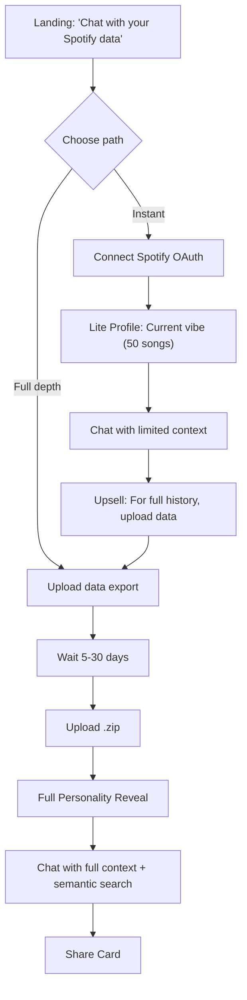

# User Experience

## Chat-First Onboarding



**Key shift:** Chat is the primary interface, not a dashboard. Users ask questions naturally.

---

## Path A: Lite (Instant)

**Spotify OAuth gives us:**
- Last 50 recently played tracks
- Top artists (4 weeks / 6 months / all time)

**We generate:**
- Current vibe snapshot
- Exploring vs. repeating pattern
- Soft upsell in every chat response

**What we CAN'T show:**
- Era detection, ghosted artists, life events, skip patterns

```
🎵 Your Current Vibe

Right now you're deep in:
• Radiohead • The National • Bon Iver

This is a snapshot. For your full emotional 
eras — the eras, the ghosts, the patterns — 
upload your complete data.
```

---

## Path B: Full (Patient)

1. Request data from Spotify
2. Wait 5-30 days
3. Upload .zip
4. Full personality reveal + semantic search

**New capability:** Semantic search across your entire history

```
You: "What was I listening to during my breakup in March 2020?"

System: "In March 2020, you played The National's 'I Need My Girl' 
127 times, mostly between 2-4am. Before that, you hadn't played 
it since 2018. This matches your 'Emotional Archaeologist' pattern."
```

---

## UX Philosophy: Chat-First Design

> ChatGPT works because you ask what you want.
> We apply that to your personal data.

### Zero-Choice Consumption

**Aggressively resist:**
- ❌ Filters
- ❌ Sliders
- ❌ "Show me more like this"
- ❌ Settings that affect content

**Instead:**
- ✅ One insight in feed (optional, 0-3x/week)
- ✅ Chat interface for exploration
- ✅ Natural language queries

### Progressive Reveal

- Week 1: "You've been avoiding high-energy music."
- Week 2: "Still in the quiet zone."
- Week 3: "Three weeks of soft listening. Something settling?"

**Recognition is the reward.** Don't explain it away.

> [!IMPORTANT]
> **Zero insights in a week is valid.** Silence is part of the product language.
> Returning `None` is a feature. Forced "notability" causes pattern hallucination.

---

## Insight Tone

| ❌ Don't | ✅ Do |
|----------|------|
| "You listened to 847 songs, up 12%" | "Heavier listening lately." |
| "Skip rate 47%, suggesting..." | "You keep starting songs but not finishing them." |
| "Based on your patterns..." | "You've been looking for something." |

**Short. Evocative. Incomplete.** User finishes the thought.

---

## First Insight (The Reveal)

```
🎵 Your Music Personality: "The Emotional Archaeologist"

You don't just listen to music — you use it to process feelings.
Your patterns show distinct "emotional eras":
• Spring 2020: Same 30 songs on repeat
• Summer 2022: Explosion of new artists

You mark time through sound.

[Share this ↗]  [Explore in chat →]
```

---

## Chat Interface

```
┌─────────────────────────────────────────────┐
│  Rhythm Chamber                    [⚙️] [↗] │
├─────────────────────────────────────────────┤
│  🎵 You're "The Emotional Archaeologist"    │
│                                             │
│  What do you want to explore?               │
│                                             │
│  ┌─────────────────────────────────────┐   │
│  │ Type your question...        [Send] │   │
│  └─────────────────────────────────────┘   │
│                                             │
│  💭 Try: "What was I like in 2019?"         │
│  💭 Try: "Show me my breakup music"         │
│  💭 Try: "When did I discover new artists?" │
└─────────────────────────────────────────────┘
```

### Chat Controls
- **Regenerate**: For when the insight didn't land.
- **Edit**: To refine the question without typing it all again.
- **Delete**: To curate the conversation history.

**Chat = active exploration. Feed = ambient awareness.**

---

## Shareable Cards (Viral Loop)

```
┌─────────────────────────────────────┐
│   🎵 Your Music Personality 🎵      │
│                                     │
│    "The Emotional Archaeologist"    │
│                                     │
│  You mark time through sound.       │
│  Your library is a scrapbook.       │
│                                     │
│  [Discover yours at RhythmChamber]  │
└─────────────────────────────────────┘
```

---

## What's NOT in MVP

- Dashboard
- Mood logging
- PDF reports
- Premium tiers
- Apple Music
- Friend comparisons
