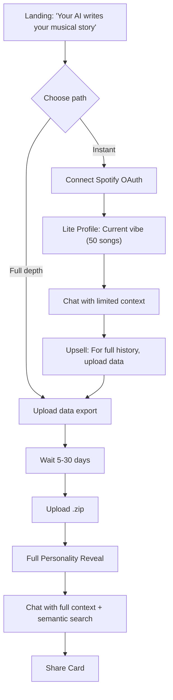

# User Experience

## Chat-First Onboarding



**Key shift:** Chat is the primary interface, not a dashboard. Users ask questions naturally.

---

## Path 0: Demo (Immediate, Sample Data)

- Loads the pre-built "Emo Teen" persona with full streams/patterns/personality
- Demo data is isolated in `AppState.demo` so nothing leaks into real uploads
- Demo badge + exit CTA keep users oriented
- Chat suggestions swap to demo-specific prompts to showcase depth instantly

Use case: let users feel the reveal and chat quality without OAuth or upload friction.

---

## Path A: Lite (Instant)

**Spotify OAuth gives us:**
- Last 50 recently played tracks
- Top artists (4 weeks / 6 months / all time)

**We generate:**
- Current vibe snapshot
- Exploring vs. repeating pattern
- Soft upsell in every chat response

**What we CAN'T show:**
- Era detection, ghosted artists, life events, skip patterns

```
🎵 Your Current Vibe

Right now you're deep in:
• Radiohead • The National • Bon Iver

This is a snapshot. For your full emotional 
eras — the eras, the ghosts, the patterns — 
upload your complete data.
```

---

## Path B: Full (Patient)

1. Request data from Spotify
2. Wait 5-30 days
3. Upload .zip
4. Full personality reveal + semantic search

**New capability:** Semantic search across your entire history

```
You: "What was I listening to during my breakup in March 2020?"

System: "In March 2020, you played The National's 'I Need My Girl' 
127 times, mostly between 2-4am. Before that, you hadn't played 
it since 2018. This matches your 'Emotional Archaeologist' pattern."
```

---

## UX Philosophy: Chat-First Design

> ChatGPT works because you ask what you want.
> We apply that to your personal data.

### Zero-Choice Consumption

**Aggressively resist:**
- ❌ Filters
- ❌ Sliders
- ❌ "Show me more like this"
- ❌ Settings that affect content

**Instead:**
- ✅ One insight in feed (optional, 0-3x/week)
- ✅ Chat interface for exploration
- ✅ Natural language queries

### Progressive Reveal

- Week 1: "You've been avoiding high-energy music."
- Week 2: "Still in the quiet zone."
- Week 3: "Three weeks of soft listening. Something settling?"

**Recognition is the reward.** Don't explain it away.

> [!IMPORTANT]
> **Zero insights in a week is valid.** Silence is part of the product language.
> Returning `None` is a feature. Forced "notability" causes pattern hallucination.

---

## Insight Tone

| ❌ Don't | ✅ Do |
|----------|------|
| "You listened to 847 songs, up 12%" | "Heavier listening lately." |
| "Skip rate 47%, suggesting..." | "You keep starting songs but not finishing them." |
| "Based on your patterns..." | "You've been looking for something." |

**Short. Evocative. Incomplete.** User finishes the thought.

---

## First Insight (The Reveal)

```
🎵 Your Music Personality: "The Emotional Archaeologist"

You don't just listen to music — you use it to process feelings.
Your patterns show distinct "emotional eras":
• Spring 2020: Same 30 songs on repeat
• Summer 2022: Explosion of new artists

You mark time through sound.

[Share this ↗]  [Explore in chat →]
```

---

## Chat Interface

```
┌─────────────────────────────────────────────┐
│  Rhythm Chamber                    [⚙️] [↗] │
├─────────────────────────────────────────────┤
│  🎵 You're "The Emotional Archaeologist"    │
│  [Verified] ← Supporter badge               │
│                                             │
│  What do you want to explore?               │
│                                             │
│  ┌─────────────────────────────────────┐   │
│  │ Type your question...        [Send] │   │
│  └─────────────────────────────────────┘   │
│                                             │
│  💭 Try: "What was I like in 2019?"         │
│  💭 Try: "Show me my breakup music"         │
│  💭 Try: "When did I discover new artists?" │
│                                             │
│  [PKM Export Available] ← Supporter feature │
│  [Friend Compare Available] ← Supporter     │
└─────────────────────────────────────────────┘
```

### Chat Controls
- **Regenerate**: For when the insight didn't land.
- **Edit**: To refine the question without typing it all again.
- **Delete**: To curate the conversation history.
- **Export Chat**: Supporter feature - save conversations locally

**Chat = active exploration. Feed = ambient awareness.**

### Inline Visualizations

The AI can generate charts and tables **directly in the chat**—no separate dashboard needed.

```
┌─────────────────────────────────────────────┐
│  You: "When did I stop listening to         │
│        Arctic Monkeys?"                      │
│                                             │
│  ┌─────────────────────────────────────┐   │
│  │  Your Arctic Monkeys Listening       │   │
│  │  Monthly plays, 2019-2020            │   │
│  │                                      │   │
│  │  127│         ●                      │   │
│  │   98│     ●                          │   │
│  │   45│   ●                            │   │
│  │   12│ ●                              │   │
│  │    0│────────────────────            │   │
│  │     Jan  Mar  May  Jul  Sep          │   │
│  │                                      │   │
│  │     ▼ Collapse    ○ Copy             │   │
│  └─────────────────────────────────────┘   │
│                                             │
│  AI: "You can see the cliff edge in June    │
│       2019. You went from playing them 127  │
│       times that month to absolutely zero   │
│       the next month. That's a pretty clean │
│       break—what happened?"                 │
└─────────────────────────────────────────────┘
```

**Visualization Types:**
- 📈 **Line Charts** — Trends over time (plays, discovery, mood)
- 📊 **Bar Charts** — Top artists/tracks, comparisons
- 📋 **Tables** — Detailed lists (ghosted favorites, eras)
- 📅 **Timelines** — Event sequences (discoveries, milestones)
- 🔥 **Heatmaps** — Calendar-style activity patterns

**Key Behaviors:**
- Charts are **ephemeral**—they exist only in the current conversation
- **Collapse/expand** to manage screen space
- **Contextual**—the AI explains both the visual AND its meaning
- **No dashboard required**—the right visualization appears when needed

---

## Profile Synthesizer UX

- Users can ask, "Create a profile for my marathon training friend" → LLM calls `synthesize_profile` to build synthetic streams/patterns/personality.
- Template search functions (`get_templates_by_genre/personality/pattern`) let chat surface curated personas for comparison.
- Synthesized profiles are saved locally (ProfileStorage) so users can revisit, compare, or delete without touching real data.
- Works alongside demo mode: try synthesis before ever uploading personal data.

---

## Shareable Cards (Viral Loop)

```
┌─────────────────────────────────────┐
│   🎵 Your Music Personality 🎵      │
│                                     │
│    "The Emotional Archaeologist"    │
│                                     │
│  You mark time through sound.       │
│  Your library is a scrapbook.       │
│                                     │
│  [Discover yours at RhythmChamber]  │
└─────────────────────────────────────┘
```

**Enhanced Sharing (Web Share API):**
- **Native Share Sheet**: Direct integration with iOS/Android share dialogs (desktop support limited to Chrome on Windows/ChromeOS) [verification needed on desktop browsers]
- **Rich Payload**: Includes image, title, personalized text, and referral link (file sharing requires platform permissions and isn't universally supported)
- **Platform-Dependent**: Instagram and some apps don't support direct posting via Web Share API—users typically save the image first, then post manually [verification needed]

**Supporter Features on Cards:**
- Premium theme styling (FREE for all - dropped paid themes)
- "Verified" badge (if supporter)
- Custom backgrounds
- Enhanced visual design

**Friend Compare Flow:**
1. User A exports profile as JSON
2. Shares via Discord/Signal (zero backend)
3. User B imports JSON
4. App runs local comparison
5. Shows: "You and Alex both have 'Emotional Archaeologist' patterns"

---

## What's NOT in MVP

- Dashboard
- Mood logging
- PDF reports
- Apple Music
- **Cloud sync**: Phase 2 (Market Signal Triggered)
- **CLI Tool**: Made open source/free (dropped from paid tier)
- **Premium Themes**: Kept free for all users

## Monetization Features

### Phase 1: Sovereign Community (Zero Cost to User)

#### Free Tier ($0)
- **Full Local Analysis**: Complete personality engine and pattern detection
- **BYOI Chat**: Bring your own intelligence—local models or your own API keys
- **Basic Cards**: Shareable personality cards
- **100% Client-Side**: Zero server costs, maximum privacy
- **Premium Themes**: Dark, Cyberpunk, Minimal styles (FREE for all)
- **Pattern Worker Pool**: Parallel pattern detection with heartbeat monitoring for worker health
- **Purpose**: Loss leader to build community and validate product

#### Supporter Tier ($39 one-time) - Seed Capital
- **Obsidian/Notion Export**: Generates folder of Markdown files with proper interlinking
  - One file per Artist, Month, and Era
  - Example: [[The National]] links to [[Sad Dad Era]] and [[March 2019]]
- **Relationship Compatibility Reports**: Upload friend's data to generate insights
  - Example: "You and Sarah have 84% overlap in 'Melancholy' but divergent 'Energy' curves in 2021. Your common anthem is 'Bloodbuzz Ohio'."
- **Verified Badge**: Visual indicator on shareable cards
- **Purpose**: Funds external security audit & cloud infrastructure
- **KPI**: Need ~250-1,000 Supporters to fund Phase 2

#### Supporter Tier ($19 first year, then $9/year) - Recurring Revenue
- **Obsidian/Notion Export**: Generates folder of Markdown files with proper interlinking
  - One file per Artist, Month, and Era
  - Example: [[The National]] links to [[Sad Dad Era]] and [[March 2019]]
- **Relationship Compatibility Reports**: Upload friend's data to generate insights
  - Example: "You and Sarah have 84% overlap in 'Melancholy' but divergent 'Energy' curves in 2021. Your common anthem is 'Bloodbuzz Ohio'."
- **Verified Badge**: Visual indicator on shareable cards
- **Purpose**: Ongoing support for security & features
- **KPI**: Need ~250-1,000 Supporters to fund Phase 2

#### Patreon Tier ($7/month) - Community
- **Dev Discord**: Community access and support
- **Roadmap Voting**: Influence feature priorities
- **Early Beta Access**: Try new features before release
- **Priority Support**: Faster response times
- **Purpose**: Sustainable community funding

### Security Audit Stretch Goal

**$10,000 raised = Security audit unlocked**

When we reach $10,000 in Supporter revenue, we will commission an external security audit to validate our zero-backend architecture and encryption implementation. This audit will be published publicly to build trust with our community.

### Implementation Strategy
- **One Codebase**: All features in main app, unlocked with license key
- **No Separate Versions**: Avoids maintenance nightmare
- **Hacker-Resistant**: Accept bypassing, target supporters who want to pay
- **Transparency**: Explicitly state revenue purpose
- **Never Deprecate Local**: Free tier remains functional forever
- **Phase 2 Trigger**: Only after ~250-1,000 Supporters + security audit
- **Revenue Allocation**: Supporter funds go directly to security audit
- **Lifetime Protection**: Separates access fee from compute costs
