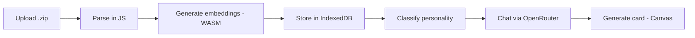

# Technical Architecture

## The Insight: No Server Needed

**Everything runs on the user's device by default.** Zero friction, zero accounts.

| Component | Cost | Who Pays |
|-----------|------|----------|
| LLM inference | $0 | OpenRouter (free tier) |
| Processing | $0 | User's browser |
| Data storage | $0 | User's localStorage |
| Embeddings | $0 | WASM in browser |
| Auth | $0 | Spotify OAuth |
| Frontend hosting | ~$0 | Vercel free tier |
| **Total per user** | **$0** | |

---

## Architecture: 100% Client-Side (Default)

```
User's Browser
├── Upload .zip
├── Parse JSON (in-browser JS)
├── Generate embeddings (WASM sentence-transformers)
├── Store in localStorage/IndexedDB
├── Run personality classification (client-side logic)
├── Chat via OpenRouter API (direct from browser)
└── Generate shareable cards (Canvas API)

Your "backend":
├── Static HTML/JS files
├── OAuth callback handler (1 serverless function)
└── That's it
```

---

## File Structure

```
rhythmchamber.com/
├── index.html          (landing page)
├── app.html            (the analyzer)
├── app.js              (all the logic)
├── prompts/            (editable prompt templates)
└── worker.js           (embeddings in Web Worker)

api/
└── auth/
    └── callback.js     (Vercel serverless - OAuth only)
```

---

## Default Flow: Zero Friction



---

## Storage: localStorage + IndexedDB (Default)

```javascript
const db = await openDB('rhythm-chamber', 1, {
  upgrade(db) {
    db.createObjectStore('streams', { keyPath: 'id' });
    db.createObjectStore('chunks', { keyPath: 'id' });
    db.createObjectStore('personality', { keyPath: 'userId' });
  },
});

await db.put('streams', { id: 'user-streams', data: parsedStreams });
```

---

## Embeddings: WASM in Web Worker (Default)

```javascript
// worker.js
import { pipeline } from '@xenova/transformers';

const embedder = await pipeline('feature-extraction', 'Xenova/all-MiniLM-L6-v2');

self.onmessage = async (e) => {
  const { summaries } = e.data;
  const embeddings = await embedder(summaries, { pooling: 'mean' });
  self.postMessage({ embeddings });
};
```

**Note:** First load downloads ~30MB model, then cached.

---

## Chat: Direct OpenRouter API

```javascript
async function chat(message, context) {
  const response = await fetch('https://openrouter.ai/api/v1/chat/completions', {
    method: 'POST',
    headers: {
      'Authorization': `Bearer ${OPENROUTER_KEY}`,
      'Content-Type': 'application/json',
    },
    body: JSON.stringify({
      model: 'mistralai/mistral-7b-instruct:free',
      messages: [
        { role: 'system', content: SYSTEM_PROMPT },
        { role: 'user', content: `${context}\n\nUser: ${message}` }
      ]
    })
  });
  return response.json();
}
```

---

## OAuth: Single Serverless Function

```javascript
// api/auth/callback.js (Vercel serverless)
export default async function handler(req, res) {
  const { code } = req.query;
  
  const token = await fetch('https://accounts.spotify.com/api/token', {
    method: 'POST',
    body: new URLSearchParams({
      grant_type: 'authorization_code',
      code,
      redirect_uri: REDIRECT_URI,
      client_id: CLIENT_ID,
      client_secret: CLIENT_SECRET,
    }),
  }).then(r => r.json());
  
  res.redirect(`/app.html?token=${token.access_token}`);
}
```

---

## Power User Option: Cloud Storage (Paid)

```
┌─────────────────────────────────────────────────────┐
│  Settings > Cloud Sync (Premium)                    │
├─────────────────────────────────────────────────────┤
│  ☐ Enable cloud storage                             │
│                                                     │
│  Benefits:                                          │
│  • Sync across devices                              │
│  • Never lose your data                             │
│  • Faster processing                                │
│                                                     │
│  Qdrant Cloud:                                      │
│  ┌───────────────────────────────────────────────┐ │
│  │ Cluster URL: https://xxxxx.qdrant.io         │ │
│  │ API Key: *********************************** │ │
│  └───────────────────────────────────────────────┘ │
│                                                     │
│  Embedding Model:                                   │
│  ● nomic-embed-text (free)                         │
│  ○ text-embedding-3-small ($0.02/1M tok)          │
│                                                     │
│  [Connect Qdrant]                                   │
└─────────────────────────────────────────────────────┘
```

### Cloud Flow (Optional)

```javascript
// Only if user enables cloud sync
async function embedAndStoreCloud(chunks, qdrantConfig) {
  // Embed via OpenRouter
  const embeddings = await fetch('https://openrouter.ai/api/v1/embeddings', {
    method: 'POST',
    headers: { 'Authorization': `Bearer ${OPENROUTER_KEY}` },
    body: JSON.stringify({
      model: 'nomic-ai/nomic-embed-text-v1.5',
      input: chunks.map(c => c.summary)
    })
  }).then(r => r.json());
  
  // Store in user's Qdrant cluster
  await fetch(`${qdrantConfig.url}/collections/${qdrantConfig.collection}/points`, {
    method: 'PUT',
    headers: { 'api-key': qdrantConfig.apiKey },
    body: JSON.stringify({
      points: chunks.map((chunk, i) => ({
        id: crypto.randomUUID(),
        vector: embeddings.data[i].embedding,
        payload: chunk
      }))
    })
  });
}
```

---

## Cost Analysis

### Default (Free Tier)

| Resource | Cost |
|----------|------|
| Vercel hosting | $0 |
| OpenRouter free models | $0 |
| WASM embeddings | $0 |
| localStorage | $0 |
| **Total** | **$0** |

### Power User (Paid)

| Resource | Cost |
|----------|------|
| Qdrant Cloud free tier | $0 |
| OpenRouter embeddings | ~$0.02/1M tokens |
| Premium LLM models | ~$0.003/1K tokens |
| **Total** | **~$1-5/month** |

---

## Why This Split Works

| Default | Power User |
|---------|------------|
| Upload → done in 2 min | Cross-device sync |
| Zero accounts needed | Persistent storage |
| Data stays on device | Faster queries |
| Casual users | Heavy users |
| **90% of users** | **10% of users** |

---

## Deployment Timeline

### Week 1: Pure Static Site
- Landing + app
- localStorage storage
- WASM embeddings
- **$0/month**

### Week 2-4: Add OAuth + Chat
- Spotify OAuth (serverless)
- OpenRouter chat integration
- **Still $0/month**

### Post-MVP: Cloud Option
- Qdrant integration
- Premium tier
- **Paid feature**

---

## Tradeoffs

| Default (Simple) | Power User (Cloud) |
|------------------|-------------------|
| ✅ Zero friction | ✅ Cross-device |
| ✅ True privacy | ✅ Persistent |
| ❌ 30MB first load | ❌ Needs Qdrant account |
| ❌ Lost if browser clears | ❌ More complex |
