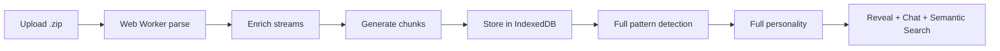
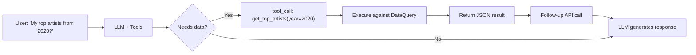
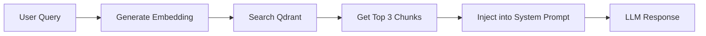

# Technical Architecture

## The Insight: Zero-Backend is Our Moat

**Everything runs on the user's device by default.** This isn't just cost-saving—it's a competitive advantage against server-dependent competitors like Stats.fm.

| Component | Cost | Who Pays | Competitive Advantage |
|-----------|------|----------|----------------------|
| LLM inference | $0 | OpenRouter (free tier) | No server costs = free tier is actually free |
| Processing | $0 | User's browser | Privacy-first, no data breach risk |
| Data storage | $0 | User's localStorage/IndexedDB | User controls their data, not us |
| **Supporter Features** | **$19 Lifetime** | **(Future)** User pays for CLI/themes/badges | **One-time unlock**—no recurring infrastructure |
| **Patreon Perks** | **$7/month** | **(Future)** Discord access, voting, early beta | **Optional**—community engagement, not code access |
| **Total (Base)** | **$0** | **Free Forever** | Stats.fm needs to monetize to survive |

**Key Insight:** Stats.fm requires server infrastructure, which means:
- They must monetize to cover hosting costs
- They control your data
- They can shut down or change pricing
- You depend on their uptime

**Rhythm Chamber:** "Your data never leaves your device, runs in your browser, you control everything."

---

## Architecture: 100% Client-Side

```
User's Browser
├── Two Onboarding Paths:
│   ├── Path A: Quick Snapshot (Spotify OAuth)
│   │   ├── PKCE auth flow (no backend)
│   │   ├── Fetch recent plays & top artists
│   │   └── Lite personality analysis
│   │
│   └── Path B: Full Analysis (File Upload)
│       ├── Upload .zip
│       ├── Parse JSON (Web Worker)
│       └── Full personality classification
│
├── Store in localStorage/IndexedDB
├── Chat via OpenRouter API (with data queries)
└── Generate shareable cards (Canvas API)

Your "backend":
└── Static HTML/JS files only (no serverless needed)
```

**This architecture is a feature, not a bug.** For the quantified-self crowd, this is hugely compelling.

---

## Modular Architecture (Refactored)

To manage complexity, the "God Objects" (chat.js, app.js, storage.js) have been decomposed into focused submodules with facade interfaces.

### 1. Storage Facade
`js/storage.js` acts as a unified entry point, delegating to specialized backends:
- **IndexedDBCore** (`js/storage/indexeddb.js`): Raw database operations.
- **ConfigAPI** (`js/storage/config-api.js`): Key-value store for settings and tokens.
- **Migration** (`js/storage/migration.js`): One-way migration from localStorage.

### 2. LLM Provider Interface
`js/chat.js` delegates all model interactions to `ProviderInterface` (`js/providers/provider-interface.js`), which routes to:
- **OpenRouter** (`js/providers/openrouter.js`): Cloud API.
- **LM Studio** (`js/providers/lmstudio.js`): Local inference.
- **Ollama** (`js/providers/ollama-adapter.js`): Local inference adapter.

### 3. Controller Pattern
UI logic is being extracted from `app.js` into focused controllers:
- **ChatUIController** (`js/controllers/chat-ui-controller.js`): Message rendering, streaming, markdown.
- **SidebarController** (`js/controllers/sidebar-controller.js`): Session list management.
- **ViewController** (`js/controllers/view-controller.js`): Transitions and state.

---

## Configuration & Persistence

The app uses a layered configuration system:

1.  **Defaults**: `config.js` provides baseline values (placeholders).
2.  **Overrides**: `localStorage` (via ConfigAPI) stores user-configured settings.
3.  **UI**: An in-app settings modal allows users to modify these.
4.  **Priority**: `config.js` > `localStorage`.

**BYOK Model (Bring Your Own Keys):**
- Users provide their own OpenRouter API key
- Users can provide their own Qdrant cluster for semantic search
- Users control their AI model choice
- **This appeals to power users who want control and transparency**

---

## File Structure (Current)

```
rhythm-chamber/
├── index.html              # Landing page
├── app.html                # Main analyzer app
├── SECURITY.md             # Security model documentation
├── css/
│   └── styles.css          # Design system
├── js/
│   ├── app.js              # Main controller (Delegates to sub-controllers)
│   ├── config.js           # API keys (gitignored)
│   ├── utils.js            # Utilities
│   │
│   ├── controllers/        # UI Logic
│   │   ├── chat-ui-controller.js
│   │   ├── sidebar-controller.js
│   │   └── view-controller.js
│   │
│   ├── providers/          # AI Providers
│   │   ├── provider-interface.js
│   │   ├── openrouter.js
│   │   ├── lmstudio.js
│   │   └── ollama-adapter.js
│   │
│   ├── storage/            # Data Layer
│   │   ├── indexeddb.js
│   │   ├── config-api.js
│   │   └── migration.js
│   │
│   ├── security/           # Security Layer
│   │   ├── encryption.js
│   │   ├── token-binding.js
│   │   ├── anomaly.js
│   │   └── index.js
│   │
│   ├── storage.js          # Storage Facade
│   ├── spotify.js          # Spotify OAuth PKCE
│   ├── security.js         # Security Facade
│   ├── payments.js         # Entitlement checks (Free MVP)
│   ├── rag.js              # Embeddings + Qdrant
│   ├── parser.js           # .zip file parsing
│   ├── patterns.js         # Pattern detection
│   ├── personality.js      # Personality classification
│   ├── data-query.js       # Chat data query utilities
│   ├── functions.js        # LLM function schemas
│   ├── chat.js             # Chat orchestration (Delegates to Providers)
│   ├── prompts.js          # Editable prompt templates
│   ├── settings.js         # Settings management
│   └── cards.js            # Shareable card generation
├── workers/
│   └── parser-worker.js    # Web Worker for .zip parsing
└── docs/
    └── *.md                # Documentation
```

---

## Data Flow: Two Paths

### Path A: Quick Snapshot (Spotify OAuth)

```mermaid
flowchart LR
    A[Click Quick Snapshot] --> B[PKCE Auth]
    B --> C[Spotify Login]
    C --> D[Callback with code]
    D --> E[Exchange for token]
    E --> F[Fetch API data]
    F --> G[Transform data]
    G --> H[Lite pattern detection]
    H --> I[Lite personality]
    I --> J[Lite Reveal + Upsell]
```



**Data Available:**
- Last 50 recently played tracks
- Top artists (short/medium/long term)
- Top tracks (short/medium/long term)
- User profile

### Path B: Full Analysis (File Upload)



**Data Available:**
- Complete streaming history
- Skip patterns, play durations
- Era detection, ghosted artists
- Time-of-day patterns
- **Semantic search across entire history**

---

## Spotify OAuth: PKCE Flow (No Backend)

```javascript
// js/spotify.js - Client-side PKCE implementation

// 1. Generate code verifier (random string)
const codeVerifier = generateRandomString(64);

// 2. Create code challenge (SHA-256 hash)
const codeChallenge = await generateCodeChallenge(codeVerifier);

// 3. Store verifier and redirect to Spotify
localStorage.setItem('spotify_code_verifier', codeVerifier);
window.location.href = `https://accounts.spotify.com/authorize?
  client_id=${CLIENT_ID}&
  response_type=code&
  ...
  code_challenge=${codeChallenge}&
  scope=user-read-recently-played user-top-read`;

// 4. On callback, exchange code for token
const response = await fetch('https://accounts.spotify.com/api/token', { ... });
```

**Key Benefits:**
- No client secret needed
- No backend required
- Tokens stored in localStorage (encrypted/bound)
- Automatic token refresh support

---

## Chat Architecture: Function Calling

The chat system uses **OpenAI-style function calling** to dynamically query user streaming data.

### Function Calling Flow



### Available Functions (js/functions.js)

| Function | Description | Parameters |
|----------|-------------|------------|
| `get_top_artists` | Top N artists for a period | year, month?, limit? |
| `get_top_tracks` | Top N tracks for a period | year, month?, limit? |
| `get_artist_history` | Full history for an artist | artist_name |
| `get_listening_stats` | Stats for a period | year?, month? |
| `compare_periods` | Compare two years | year1, year2 |
| `search_tracks` | Search for a track | track_name |

---

## Semantic Search: The Competitive Moat

### Architecture Overview

Users can enable RAG-powered semantic search using their own Qdrant Cloud cluster:



### Why This Matters vs Stats.fm

**Stats.fm:** "Click to explore charts"
**Rhythm Chamber:** "Ask natural questions"

**Example:**
- **Stats.fm:** Shows you a chart of "March 2020 Top Artists"
- **Rhythm Chamber:** You ask "What was I listening to during my breakup in March 2020?" → Gets semantic answer with context

### Components

| Module | Purpose |
|--------|---------|
| `payments.js` | Entitlement stub (always returns true for MVP) |
| `rag.js` | Embeddings API, Qdrant client, chunking logic |

### Embedding Generation

```javascript
// js/rag.js - generateEmbeddings()
// 1. Load all streams from IndexedDB
// 2. Create chunks (monthly summaries + artist profiles)
// 3. Generate embeddings via OpenRouter (qwen/qwen3-embedding-8b)
// 4. Upsert to user's Qdrant cluster
// 5. Store config + status in localStorage
```

---

## Storage: IndexedDB + localStorage

### IndexedDB Stores

| Store | Key | Content |
|-------|-----|---------|
| `streams` | `'user-streams'` | Raw Spotify streaming history |
| `chunks` | `'user-chunks'` | Aggregated weekly/monthly data |
| `personality` | `'result'` | Personality classification result |
| `settings` | key | User preferences |
| `chat_sessions` | session ID | **Persistent chat conversations** |
| `config` | Various | Persistent settings (ConfigAPI) |
| `tokens` | Various | Encrypted/Bound tokens (ConfigAPI) |

```javascript
// js/storage.js (Facade)

// Delegates to js/storage/indexeddb.js
await Storage.saveStreams(parsedStreams);

// Delegates to js/storage/config-api.js
await Storage.saveSetting('theme', 'dark');

// Delegates to js/storage/migration.js
await Storage.migrateFromLocalStorage();
```

---

## Pattern Detection

### Full Analysis Patterns (patterns.js)

| Pattern | Description |
|---------|-------------|
| `eras` | Distinct listening periods based on taste shifts |
| `ghostedArtists` | Artists you stopped listening to |
| `trueFavorites` | Artists with high completion rates |
| `timeOfDay` | Morning vs evening listening patterns |
| `weekdayWeekend` | Weekday vs weekend differences |
| `skipBehavior` | Skip patterns and completion rates |

### Lite Analysis Patterns (Spotify API data)

| Pattern | Description |
|---------|-------------|
| `diversity` | Artist variety in recent plays |
| `currentObsession` | Most repeated artist recently |
| `tasteStability` | Short-term vs long-term taste consistency |
| `risingStars` | New artists entering rotation |
| `genreProfile` | Top genres from artist data |

---

## Personality Types

### Full Personality Types

| Type | Description |
|------|-------------|
| Emotional Archaeologist | Uses music to process feelings |
| Mood Engineer | Strategically deploys music |
| Discovery Junkie | Always seeking new artists |
| Comfort Curator | Sticks to beloved favorites |
| Social Chameleon | Music adapts to context |

### Lite Personality Types

| Type | Description |
|------|-------------|
| The Current Obsessor | Deep in one sound right now |
| The Sound Explorer | Always seeking new territory |
| The Taste Keeper | Knows exactly what they love |
| The Taste Shifter | Musical journey in motion |

---

## Chat: OpenRouter Integration

```javascript
// js/chat.js (via ProviderInterface)

async function sendMessage(message) {
  // Configured provider (OpenRouter, LMStudio, or Ollama)
  const providerConfig = await ProviderInterface.buildProviderConfig(
    settings.provider, 
    settings
  );
  
  // Unified call via interface
  const response = await ProviderInterface.callProvider(
    providerConfig, 
    apiKey, 
    messages, 
    tools
  );
  
  return response;
}
```

---

## Cost Analysis

### Default (Free Tier)

| Resource | Cost |
|----------|------|
| Vercel hosting | $0 |
| OpenRouter free models | $0 |
| localStorage/IndexedDB | $0 |
| Spotify OAuth (PKCE) | $0 |
| **Total** | **$0** |

### Supporter Tier ($19 Lifetime)

| Resource | Cost |
|----------|------|
| CLI tool (Node.js wrapper) | $0 (uses existing JS) |
| Premium themes (CSS) | $0 |
| Badge generation (Canvas) | $0 |
| Friend compare (JSON) | $0 |
| **Total** | **$0 infrastructure** |

### Patreon Tier ($7/month)

| Resource | Cost |
|----------|------|
| Discord server | ~$5/month |
| Early beta access | $0 (same codebase) |
| Roadmap voting | $0 (community tool) |
| **Total** | **~$5/month net** |

### With Premium LLM

| Resource | Cost |
|----------|------|
| Premium LLM models | ~$0.003/1K tokens |
| **Total** | **~$1-5/month** |

---

## Security Considerations

### Core Security Model

This application uses a **100% client-side security model**. All security measures are implemented in the browser, which provides defense-in-depth but cannot match server-side security.

> **Full threat model documented in `SECURITY.md`**

### Security Features (Implemented)

| Feature | Implementation | Purpose |
|---------|----------------|---------|
| **AES-GCM Credential Encryption** | `security.js` | RAG credentials encrypted with session-derived keys |
| **XSS Token Binding** | `security.js`, `spotify.js` | Spotify tokens bound to device fingerprint |
| **Secure Context Enforcement** | `security.js` | Blocks operation in iframes, data: protocols |
| **Session Versioning** | `security.js` | Keys invalidated on auth failures |
| **Background Token Refresh** | `spotify.js` | Proactive refresh during long operations |
| **Adaptive Lockout Thresholds** | `security.js` | Travel-aware threshold adjustment |
| **Geographic Anomaly Detection** | `security.js` | Detects proxy/VPN-based attacks |
| **Rate Limiting** | `security.js` | Prevents credential stuffing |
| **Namespace Isolation** | `rag.js` | Per-user RAG collections |
| **Unified Error Context** | `security.js` | Structured errors with recovery paths |
| **Privacy Controls** | `storage.js` | Session-only mode, data cleanup |

---

## Deployment

### Static Site Deployment (Vercel/Netlify)

1. Clone repository
2. Copy `js/config.example.js` to `js/config.js`
3. Add Spotify Client ID from Developer Dashboard
4. Add redirect URI to Spotify app settings
5. Deploy static files

### CLI Tool Distribution (Supporter Tier)

```bash
# Node.js CLI wrapper
npm install -g rhythm-chamber-cli

# Commands
rhythm-chamber analyze ./spotify-export.zip
rhythm-chamber compare friend-profile.json
rhythm-chamber generate-card --theme cyberpunk
```

**Implementation**: Wraps `js/parser.js` and `js/data-query.js` in Node.js CLI interface

### Local Development

```bash
# Simple HTTP server
python -m http.server 8080

# Or use any static file server
npx serve .
```

---

## Future Enhancements (Post-MVP)

### Free Tier
- [ ] Cloud sync option (Qdrant/Pinecone) - optional paid
- [ ] WASM embeddings for semantic search
- [ ] Playlist generation based on patterns

### Supporter Tier ($19 Lifetime)
- [x] CLI tool for batch processing
- [x] Premium themes (Dark, Cyberpunk, Minimal)
- [x] "Verified" badge on cards
- [x] Friend compare via JSON export/import

### Patreon Tier ($7/month)
- [ ] Dev Discord community
- [ ] Roadmap voting rights
- [ ] Early access to beta features
- [ ] Priority support

### Technical Architecture Notes
- **One Codebase**: All features in main app, unlocked with license key
- **No Separate Versions**: Avoids maintenance nightmare
- **License Key System**: Simple check in `js/settings.js`
- **Hacker-Resistant**: Accept that bypassing is possible, target supporters who want to pay
