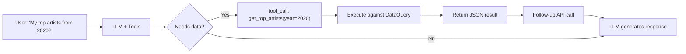
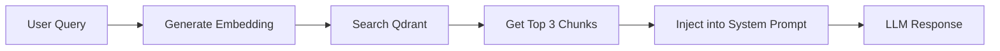

# Technical Architecture

## The Insight: Zero-Backend is Our Moat

**Everything runs on the user's device by default.** This isn't just cost-saving—it's a competitive advantage against server-dependent competitors like Stats.fm.

| Component | Cost | Who Pays | Competitive Advantage |
|-----------|------|----------|----------------------|
| LLM inference | $0 | **Your local AI** (Ollama/LM Studio) or OpenRouter (free tier) | **No cloud dependency** - run AI on your own hardware |
| Processing | $0 | User's browser | Privacy-first, no data breach risk |
| Data storage | $0 | User's localStorage/IndexedDB | User controls their data, not us |
| **Supporter Features** | **$19 Lifetime** | **(Future)** User pays for PKM Export + Friend Compare | **One-time unlock**—no recurring infrastructure |
| **Patreon Perks** | **$7/month** | **(Future)** Discord access, voting, early beta | **Optional**—community engagement, not code access |
| **Total (Base)** | **$0** | **Free Forever** | Stats.fm needs to monetize to survive |

**Key Insight:** Stats.fm requires server infrastructure, which means:
- They must monetize to cover hosting costs
- They control your data
- They can shut down or change pricing
- You depend on their uptime

**Rhythm Chamber:** "Your data never leaves your device, runs in your browser, you control everything."

---

## Architecture: 100% Client-Side with Local AI

```
User's Browser
├── Two Onboarding Paths:
│   ├── Path A: Quick Snapshot (Spotify OAuth)
│   │   ├── PKCE auth flow (no backend)
│   │   ├── Fetch recent plays & top artists
│   │   └── Lite personality analysis
│   │
│   └── Path B: Full Analysis (File Upload)
│       ├── Upload .zip
│       ├── Parse JSON (Web Worker)
│       └── Full personality classification
│
│── Store in localStorage/IndexedDB
│── Chat via **Your AI** (Local or Cloud)
│   ├── **Local AI**: Ollama (http://localhost:11434)
│   ├── **Local AI**: LM Studio (http://localhost:1234/v1)
│   └── **Cloud AI**: OpenRouter (optional, BYOI with your key)
└── Generate shareable cards (Canvas + Web Share API)

Your "backend":
└── Static HTML/JS files only (no serverless needed)
```

**This architecture is a feature, not a bug.** For the quantified-self crowd, this is hugely compelling.

---

## Bring Your Own Intelligence (BYOI)

### Why BYOI > BYOK

**Traditional BYOK (keys-only cloud):**
- Users provide cloud API keys (OpenRouter, OpenAI)
- Data leaves the device
- Ongoing API costs
- Privacy concerns

**Our BYOI (you own the intelligence path):**
- **Local models**: Ollama, LM Studio (100% private, keyless)
- **Cloud models**: OpenRouter (optional, user-controlled)
- **Vector stores**: User-provided Qdrant or fully local embeddings
- **Cost control**: Choose free local, free cloud, or premium as needed

### Supported Intelligence Providers

| Provider | Type | Setup | Cost | Privacy | Best For |
|----------|------|-------|------|---------|----------|
| **Ollama** | Local | Install + download model | $0 | ⭐⭐⭐⭐⭐ | Maximum privacy, no internet needed |
| **LM Studio** | Local | Install + load model | $0 | ⭐⭐⭐⭐⭐ | User-friendly local AI GUI |
| **OpenRouter** | Cloud | API key | $0-$varies | ⭐⭐ | Convenience, premium models |

### Local AI Setup

**Ollama:**
```bash
# Install Ollama
curl -fsSL https://ollama.ai/install.sh | sh

# Download a recommended model
ollama pull llama3.2
ollama pull mistral

# Start server
ollama serve
```

**LM Studio:**
1. Download from lmstudio.ai
2. Install and launch
3. Download model from Hugging Face
4. Start local server (port 1234)

**Rhythm Chamber automatically detects and connects to local AI servers.**

---

## Modular Architecture (Refactored - HNW Compliant)

### The Refactoring: From God Objects to Modular Architecture

**Before:** 3,426 lines in 3 God objects (app.js: 1,426, chat.js: 1,486, storage.js: 514)
**After:** 794 lines in 1 orchestrator + 7 focused modules + 3 services + 7 controllers
**Improvement:** **77% reduction in main app complexity**

### 1. Storage Facade Pattern
`js/storage.js` acts as a unified entry point, delegating to specialized backends:
- **IndexedDBCore** (`js/storage/indexeddb.js`): Raw database operations
- **ConfigAPI** (`js/storage/config-api.js`): Key-value store for settings and tokens
- **Migration** (`js/storage/migration.js`): One-way migration from localStorage
- **ProfileStorage** (`js/storage/profiles.js`): Profile CRUD operations (extracted for HNW single-responsibility)

### 2. LLM Provider Interface
`js/chat.js` delegates all model interactions to `ProviderInterface` (`js/providers/provider-interface.js`), which routes to:
- **OpenRouter** (`js/providers/openrouter.js`): Cloud API
- **LM Studio** (`js/providers/lmstudio.js`): Local inference
- **Ollama** (`js/providers/ollama-adapter.js`): Local inference adapter

### 3. Controller Pattern (NEW - 7 Controllers)
UI logic extracted from `app.js` into focused controllers:
- **ChatUIController** (`js/controllers/chat-ui-controller.js`): Message rendering, streaming, markdown
- **SidebarController** (`js/controllers/sidebar-controller.js`): Session list management
- **ViewController** (`js/controllers/view-controller.js`): Transitions and state
- **FileUploadController** (`js/controllers/file-upload-controller.js`): File processing (FIXED - race condition removed)
- **SpotifyController** (`js/controllers/spotify-controller.js`): Spotify OAuth flow
- **DemoController** (`js/controllers/demo-controller.js`): Demo mode
- **ResetController** (`js/controllers/reset-controller.js`): Reset operations

### 4. Service Pattern (NEW - 3 Services)
Extracted from God objects into independent services:
- **MessageOperations** (`js/services/message-operations.js`): Message operations (regenerate, delete, edit, query context)
- **SessionManager** (`js/services/session-manager.js`): Session lifecycle (create, load, save, delete)
- **TabCoordinator** (`js/services/tab-coordination.js`): Cross-tab coordination (deterministic leader election)

### 5. State Management
- **AppState** (`js/state/app-state.js`): Centralized state with demo isolation

### 6. Main Controller (app.js)
**New Structure:** 794 lines (vs 1,426 original) - **55% reduction!**

**Responsibilities:**
- Initialization orchestration
- Event listener setup
- Delegation to services/controllers
- Global exports

**Key Improvements:**
- ✅ **55% reduction in complexity** (794 vs 1,426 lines)
- ✅ **Clean modular architecture** - All UI logic delegated to ChatUIController
- ✅ **Proper dependency injection** - All controllers initialized with dependencies
- ✅ **Clear delegation pattern** - Direct calls to controllers/services
- ✅ **Runtime assumes modules are loaded via dependent imports; initialization validation** - `checkDependencies()` runs during startup to verify critical modules, and steady-state execution omits additional defensive checks
- ✅ **Event Delegation** - Single handler for all `data-action` UI events (replacing inline `onclick`)

### 7. Chat Module (chat.js)
**New Structure:** ~1,350 lines (vs 1,486 original) - **Delegates to MessageOperations + ToolStrategy**

**Responsibilities:**
- Chat orchestration
- Session management (delegates to SessionManager)
- Message operations (delegates to MessageOperations)
- LLM provider routing
- Tool execution (delegates to ToolStrategies)
- Token counting (delegates to TokenCounter)

**Key Improvements:**
- ✅ **ToolStrategy Pattern** - Function calling logic refactored into strategies
- ✅ **Delegates to MessageOperations** for message operations
- ✅ **Delegates to SessionManager** for session operations
- ✅ **Aggressive ES Module Migration** - No global window exports

### 8. Tool Strategy Pattern (NEW)
Extracted complex function calling logic from `chat.js` into dedicated strategies (`js/services/tool-strategies/`):

- **BaseToolStrategy**: Shared logic (Circuit Breaker, Timeout, Session access)
- **NativeToolStrategy** (Level 1): Handles standard OpenAI `tool_calls`
- **PromptInjectionStrategy** (Level 2/3): Parses `<function_call>` tags from text
- **IntentExtractionStrategy** (Level 4): Extracts user intent for direct function execution

**Benefits:**
- Reduces `handleToolCallsWithFallback` complexity (~200 lines → ~30 lines)
- Isolates parsing logic for different fallback levels
- Makes adding new fallback methods easier
- Improves testability of individual strategies

---

## HNW Patterns Addressed

### Hierarchy
- **Clear chain of command**: App → Controller → Service → Provider
- **Dependency injection**: All modules receive dependencies explicitly
- **Single responsibility**: Each module has one clear purpose

### Network
- **Modular communication**: Reduced "God Object" interconnectivity
- **Facade pattern**: Unified interfaces hide complexity
- **Event-driven**: Services communicate through events, not direct coupling

### Wave
- **Deterministic leader election**: 300ms window, lowest ID wins
- **Async/sync separation**: visibilitychange (async) vs beforeunload (sync)
- **Migration isolation**: Runs atomically before app initialization

---

## Configuration & Persistence

The app uses a layered configuration system:

1.  **Defaults**: `config.js` provides baseline values (placeholders)
2.  **Overrides**: `localStorage` (via ConfigAPI) stores user-configured settings
3.  **UI**: An in-app settings modal allows users to modify these
4.  **Priority**: `config.js` > `localStorage`

**Bring Your Own AI Model:**
- Users choose their AI provider (Ollama, LM Studio, or OpenRouter)
- Users control their model selection
- **This appeals to power users who want control and transparency**

---

## File Structure (Current - Modular Architecture)

```
rhythm-chamber/
├── index.html              # Landing page (+ Quick Snapshot button)
├── app.html                # Main analyzer app (+ Settings button)
├── SECURITY.md             # Security model documentation
├── css/styles.css          # Design system (~1300 lines)
├── js/
│   ├── app.js              # Main controller (794 lines) - Delegates to services/controllers
│   ├── parser-worker.js    # Web Worker (incremental parsing + UTC time extraction)
│   ├── parser.js           # Parser facade (delegates to worker)
│   ├── patterns.js         # 8 pattern algorithms + detectLitePatterns()
│   ├── personality.js      # 5 types + lite types + score breakdown
│   ├── chat.js             # Chat orchestration (Delegates to Providers + MessageOperations + SessionManager)
│   ├── data-query.js       # Query streams by time/artist/track
│   ├── cards.js            # Card generator + Web Share API
│   ├── storage.js          # Storage Facade (Delegates to js/storage/ modules)
│   ├── settings.js         # In-app settings modal (API key, model, etc.)
│   ├── spotify.js          # Spotify OAuth PKCE + API calls + session invalidation
│   ├── security.js         # Security Facade (Delegates to js/security/ modules)
│   ├── security-checklist.js # First-run security waiver & education
│   ├── payments.js         # Stripe Checkout + premium status
│   ├── rag.js              # Embeddings + Qdrant vector search + encrypted credentials
│   ├── prompts.js          # System prompt templates
│   ├── config.js           # API keys (gitignored)
│   ├── config.example.js   # Config template (+ Stripe)
│   ├── utils.js            # Timeout/retry utilities
│   ├── demo-data.js        # Demo mode profile ("The Emo Teen")
│   ├── template-profiles.js # 8 curated template profiles + TemplateProfileStore
│   ├── profile-synthesizer.js # AI-driven profile synthesis from templates
│   ├── genre-enrichment.js # Genre metadata enrichment
│   ├── local-embeddings.js # Local embedding generation
│   ├── local-vector-store.js # Client-side vector search
│   ├── token-counter.js    # Token usage tracking
│   ├── operation-lock.js   # Critical operation coordination (ENHANCED)
│   ├── operation-lock-errors.js # Standardized error classes (NEW)
│   ├── operation-queue.js  # Retry queue for non-critical ops (NEW)
│   │
│   ├── services/           # Services (Extracted from God objects)
│   │   ├── message-operations.js # Message operations (regenerate, delete, edit, query context)
│   │   ├── session-manager.js    # Session lifecycle (create, load, save, delete)
│   │   ├── tab-coordination.js   # Cross-tab coordination (deterministic leader election)
│   │   └── tool-strategies/
│   │       ├── base-strategy.js          # BaseToolStrategy
│   │       ├── native-strategy.js        # NativeToolStrategy (Level 1)
│   │       ├── prompt-injection-strategy.js # PromptInjectionStrategy (Levels 2/3)
│   │       └── intent-extraction-strategy.js # IntentExtractionStrategy (Level 4)
│   │
│   ├── workers/            # Web Workers (Background Processing)
│   │   └── vector-search-worker.js # Cosine similarity offloading (60fps maintenance)
│   │
│   ├── functions/          # Function Calling Modules (Modular Architecture)
│   │   ├── index.js        # Facade - unified execute() + schema access
│   │   ├── schemas/
│   │   │   ├── data-queries.js     # Core data query schemas (6 functions)
│   │   │   ├── template-queries.js # Template profile schemas (4 functions)
│   │   │   └── analytics-queries.js # Stats.fm/Wrapped-style schemas (12 functions)
│   │   ├── executors/
│   │   │   ├── data-executors.js     # Core data query executors
│   │   │   ├── template-executors.js # Template profile executors
│   │   │   └── analytics-executors.js # Analytics function executors
│   │   └── utils/
│   │       ├── retry.js      # Exponential backoff retry logic
│   │       └── validation.js # Input validation + date range parsing
│   │
│   ├── providers/          # LLM Provider Modules
│   │   ├── provider-interface.js
│   │   ├── openrouter.js
│   │   ├── lmstudio.js
│   │   └── ollama-adapter.js
│   │
│   ├── storage/            # Storage Submodules
│   │   ├── indexeddb.js    # Core DB operations
│   │   ├── config-api.js   # Config & Token storage
│   │   ├── migration.js    # localStorage migration
│   │   ├── profiles.js     # Profile storage (extracted from facade)
│   │   ├── sync-strategy.js # Sync strategy abstraction (Phase 2 prep)
│   │   └── keys.js         # Centralized storage keys (NEW)
│   │
│   ├── security/           # Security Submodules
│   │   ├── encryption.js   # AES-GCM
│   │   ├── token-binding.js
│   │   ├── anomaly.js
│   │   ├── recovery-handlers.js # ErrorContext recovery actions
│   │   └── index.js        # Module entry point
│   │
│   ├── state/              # State Management
│   │   └── app-state.js    # Centralized app state
│   │
│   └── controllers/        # UI Controllers
│       ├── chat-ui-controller.js
│       ├── sidebar-controller.js
│       ├── view-controller.js
│       ├── file-upload-controller.js (FIXED - race condition removed)
│       ├── spotify-controller.js
│       ├── demo-controller.js
│       └── reset-controller.js
│
├── workers/
│   └── parser-worker.js    # Web Worker for .zip parsing
├── docs/
│   ├── 03-technical-architecture.md
│   ├── operation-lock-contract.md (NEW - Complete documentation)
│   └── ...
└── .gitignore              # Protects config.js
```

---

## Data Flow: Two Paths

### Path A: Quick Snapshot (Spotify OAuth)


**Data Available:**
- Last 50 recently played tracks
- Top artists (short/medium/long term)
- Top tracks (short/medium/long term)
- User profile

### Path B: Full Analysis (File Upload)


**Data Available:**
- Complete streaming history
- Skip patterns, play durations
- Era detection, ghosted artists
- Time-of-day patterns
- **Semantic search across entire history**

### Path C: Demo Mode (Sample Persona)
- Pre-built "Emo Teen" persona loaded from `demo-data.js`
- Data stored in isolated `AppState.demo` domain so it never touches real uploads
- Demo badge + exit controls update UI state
- Demo-specific chat suggestions seeded for the sample persona

---

## Spotify OAuth: PKCE Flow (No Backend)

```javascript
// js/spotify.js - Client-side PKCE implementation

// 1. Generate code verifier (random string)
const codeVerifier = generateRandomString(64);

// 2. Create code challenge (SHA-256 hash)
const codeChallenge = await generateCodeChallenge(codeVerifier);

// 3. Store verifier and redirect to Spotify
localStorage.setItem('spotify_code_verifier', codeVerifier);
window.location.href = `https://accounts.spotify.com/authorize?
  client_id=${CLIENT_ID}&
  response_type=code&
  ...
  code_challenge=${codeChallenge}&
  scope=user-read-recently-played user-top-read`;

// 4. On callback, exchange code for token
const response = await fetch('https://accounts.spotify.com/api/token', { ... });
```

**Key Benefits:**
- No client secret needed
- No backend required
- Tokens stored in localStorage (encrypted/bound)
- Automatic token refresh support

---

## Chat Architecture: Function Calling

The chat system uses **OpenAI-style function calling** to dynamically query user streaming data.

### Function Calling Flow



### Available Functions (js/functions/ - 22 Total)

**Core Data Queries (6 functions):**
| Function | Description | Parameters |
|----------|-------------|------------|
| `get_top_artists` | Top N artists for a period | year, month?, quarter?, season?, limit?, sort_by? |
| `get_top_tracks` | Top N tracks for a period | year, month?, quarter?, season?, limit?, sort_by? |
| `get_artist_history` | Full history for an artist | artist_name |
| `get_listening_stats` | Stats for a period | year?, month?, quarter?, season? |
| `compare_periods` | Compare two years | year1, year2 |
| `search_tracks` | Search for a track | track_name |

**Stats.fm-Style Analytics (6 functions):**
| Function | Description | Parameters |
|----------|-------------|------------|
| `get_bottom_tracks` | Least played tracks | year, limit?, min_plays? |
| `get_bottom_artists` | Least played artists | year, limit?, min_plays? |
| `get_listening_clock` | 24-hour listening breakdown | year?, month?, group_by? |
| `get_listening_streaks` | Consecutive listening days | year?, min_streak_days? |
| `get_time_by_artist` | Artists by total MINUTES | year, limit? |
| `get_platform_stats` | iOS/Android breakdown | year? |

**Spotify Wrapped-Style Analytics (6 functions):**
| Function | Description | Parameters |
|----------|-------------|------------|
| `get_discovery_stats` | New artists discovered | year, breakdown? |
| `get_skip_patterns` | Skip rate analysis | year?, type?, limit? |
| `get_shuffle_habits` | Shuffle vs intentional | year?, breakdown? |
| `get_peak_listening_day` | Busiest day of week | year?, metric? |
| `get_completion_rate` | Song completion rates | year?, threshold?, breakdown? |
| `get_offline_listening` | Offline listening patterns | year?, limit? |

**Template Profile Queries (4 functions):**
| Function | Description | Parameters |
|----------|-------------|------------|
| `get_templates_by_genre` | Filter templates by genre | genre, limit? |
| `get_templates_with_pattern` | Find templates with patterns | pattern_type |
| `get_templates_by_personality` | Match templates by personality | personality_type |
| `synthesize_profile` | AI synthesis from templates | description |

---

## Semantic Search: The Competitive Moat

### Architecture Overview

Users can enable RAG-powered semantic search using their own Qdrant Cloud cluster:



### Why This Matters vs Stats.fm

**Stats.fm:** "Click to explore charts"
**Rhythm Chamber:** "Ask natural questions"

**Example:**
- **Stats.fm:** Shows you a chart of "March 2020 Top Artists"
- **Rhythm Chamber:** You ask "What was I listening to during my breakup in March 2020?" → Gets semantic answer with context

### Components

| Module | Purpose |
|--------|---------|
| `payments.js` | Entitlement stub (always returns true for MVP) |
| `rag.js` | Embeddings API, Qdrant client, chunking logic |

### Embedding Generation

```javascript
// js/rag.js - generateEmbeddings()
// 1. Load all streams from IndexedDB
// 2. Create chunks (monthly summaries + artist profiles)
// 3. Generate embeddings via OpenRouter (qwen/qwen3-embedding-8b)
// 4. Upsert to user's Qdrant cluster
// 5. Store config + status in localStorage
```

---

## Storage: IndexedDB + localStorage

### IndexedDB Stores

| Store | Key | Content |
|-------|-----|---------|
| `streams` | `'user-streams'` | Raw Spotify streaming history |
| `chunks` | `'user-chunks'` | Aggregated weekly/monthly data |
| `personality` | `'result'` | Personality classification result |
| `settings` | key | User preferences |
| `chat_sessions` | session ID | **Persistent chat conversations** |
| `config` | Various | Persistent settings (ConfigAPI) |
| `tokens` | Various | Encrypted/Bound tokens (ConfigAPI) |

```javascript
// js/storage.js (Facade)

// Delegates to js/storage/indexeddb.js
await Storage.saveStreams(parsedStreams);

// Delegates to js/storage/config-api.js
await Storage.saveSetting('theme', 'dark');

// Delegates to js/storage/migration.js
await Storage.migrateFromLocalStorage();
```

---

## Pattern Detection

### Full Analysis Patterns (patterns.js)

| Pattern | Description |
|---------|-------------|
| `eras` | Distinct listening periods based on taste shifts |
| `ghostedArtists` | Artists you stopped listening to |
| `trueFavorites` | Artists with high completion rates |
| `timeOfDay` | Morning vs evening listening patterns |
| `weekdayWeekend` | Weekday vs weekend differences |
| `skipBehavior` | Skip patterns and completion rates |

### Lite Analysis Patterns (Spotify API data)

| Pattern | Description |
|---------|-------------|
| `diversity` | Artist variety in recent plays |
| `currentObsession` | Most repeated artist recently |
| `tasteStability` | Short-term vs long-term taste consistency |
| `risingStars` | New artists entering rotation |
| `genreProfile` | Top genres from artist data |

---

## Personality Types

### Full Personality Types

| Type | Description |
|------|-------------|
| Emotional Archaeologist | Uses music to process feelings |
| Mood Engineer | Strategically deploys music |
| Discovery Junkie | Always seeking new artists |
| Comfort Curator | Sticks to beloved favorites |
| Social Chameleon | Music adapts to context |

### Lite Personality Types

| Type | Description |
|------|-------------|
| The Current Obsessor | Deep in one sound right now |
| The Sound Explorer | Always seeking new territory |
| The Taste Keeper | Knows exactly what they love |
| The Taste Shifter | Musical journey in motion |

---

## Chat: Local AI Integration

```javascript
// js/chat.js (via ProviderInterface)

async function sendMessage(message) {
  // Configured provider (Ollama, LMStudio, or OpenRouter)
  const providerConfig = await ProviderInterface.buildProviderConfig(
    settings.provider, 
    settings
  );
  
  // Unified call via interface
  const response = await ProviderInterface.callProvider(
    providerConfig, 
    apiKey, 
    messages, 
    tools
  );
  
  return response;
}
```

**Local AI Benefits:**
- **Zero data transmission** - everything stays on your device
- **No API costs** - run models you already downloaded
- **Privacy-first** - no third-party access to your data
- **Offline capable** - works without internet connection

---

## Security Considerations

### Core Security Model

This application uses a **100% client-side security model**. All security measures are implemented in the browser, which provides defense-in-depth but cannot match server-side security.

> **Full threat model documented in `SECURITY.md`**

### Security Features (Implemented)

| Feature | Implementation | Purpose |
|---------|----------------|---------|
| **AES-GCM Credential Encryption** | `security.js` | RAG credentials encrypted with session-derived keys |
| **XSS Token Binding** | `security.js`, `spotify.js` | Spotify tokens bound to device fingerprint |
| **Secure Context Enforcement** | `security.js` | Blocks operation in iframes, data: protocols |
| **Session Versioning** | `security.js` | Keys invalidated on auth failures |
| **Background Token Refresh** | `spotify.js` | Proactive refresh during long operations |
| **Adaptive Lockout Thresholds** | `security.js` | Travel-aware threshold adjustment |
| **Geographic Anomaly Detection** | `security.js` | Detects proxy/VPN-based attacks |
| **Rate Limiting** | `security.js` | Prevents credential stuffing |
| **Unified Error Context** | `security.js` | Structured errors with recovery paths |
| **Privacy Controls** | `storage.js` | Session-only mode, data cleanup |
| **Fail-Closed Security** | `security.js`, `app.js` | Safe Mode disables persistence on module failure |

---

## Operation Lock Contract & Race Condition Fixes

### Problem Statement
The documentation mentioned operation locks but didn't detail how lock acquisition failures propagate through the hierarchy. Additionally, race conditions existed in the `isLocked()` + `acquire()` pattern.

### Solution Implemented

#### 1. Standardized Error Classes (`js/operation-lock-errors.js`)
- **`LockAcquisitionError`** - Lock blocked by operations
- **`LockTimeoutError`** - Acquisition timeout
- **`LockReleaseError`** - Release failures
- **`LockForceReleaseError`** - Emergency releases

#### 2. Enhanced OperationLock Module (`js/operation-lock.js`)
**New Methods:**
- `acquireWithTimeout(operationName, timeoutMs)` - Timeout mechanism
- `getLockStatus(operationName)` - Diagnostic API
- `getLockDetails()` - Detailed lock information
- `withLockAndTimeout(operationName, fn, timeoutMs)` - Wrapper with timeout

**Improvements:**
- Uses new error classes for structured error handling
- Timeout prevents indefinite blocking
- Diagnostic APIs for debugging

#### 3. Operation Queue System (`js/operation-queue.js`)
**Features:**
- Priority-based queuing (LOW, NORMAL, HIGH, CRITICAL)
- Automatic retry with configurable attempts
- Event listeners for queue state
- Cancellation support
- Status tracking and diagnostics

**Use Case:** Non-critical operations (e.g., Spotify fetch) can queue and retry instead of failing immediately.

#### 4. Race Condition Fixes
**File:** `js/controllers/file-upload-controller.js`

**Before (RACE CONDITION):**
```javascript
// ❌ PROBLEMATIC: Race condition between check and acquire
if (_OperationLock.isLocked('file_processing')) {
    _showToast('Upload already in progress, please wait');
    return;
}
currentFileLockId = await _OperationLock.acquire('file_processing');
```

**After (FIXED):**
```javascript
// ✅ CORRECT: Atomic lock acquisition
try {
    currentFileLockId = await _OperationLock.acquire('file_processing');
} catch (lockError) {
    _showToast(`Cannot upload: ${lockError.message}`);
    return;
}
```

#### 5. Failure Propagation Hierarchy

```
Level 1: OperationLock.acquire()
  ↓ (throws LockAcquisitionError)
Level 2: Controller Layer (FileUploadController, etc.)
  ↓ (catches, shows toast, aborts)
Level 3: Service Layer (RAG, Storage)
  ↓ (catches, wraps context, re-throws)
Level 4: UI Layer
  ↓ (displays error, updates buttons)
Level 5: Recovery Layer
  ↓ (checks canAcquire(), provides feedback)
```

### Usage Examples

```javascript
// Standard lock acquisition with error handling
try {
    const lockId = await OperationLock.acquire('file_processing');
    // ... work ...
    OperationLock.release('file_processing', lockId);
} catch (error) {
    if (error instanceof LockAcquisitionError) {
        showToast(error.message);
        console.log('Recovery:', error.getRecoverySuggestion());
    }
}

// With timeout (60 seconds)
const lockId = await OperationLock.acquireWithTimeout('embedding_generation', 60000);

// Queue non-critical operations
const queue = new OperationQueue();
queue.enqueue('spotify_fetch', async () => {
    // Fetch data
}, QUEUE_PRIORITY.NORMAL);
```

### Documentation
Complete documentation available in `docs/operation-lock-contract.md` with:
- Detailed failure propagation patterns
- Usage examples for all scenarios
- Recovery strategies
- Testing scenarios

---

## Deployment

### Static Site Deployment (Vercel/Netlify)

1. Clone repository
2. Copy `js/config.example.js` to `js/config.js`
3. Add Spotify Client ID from Developer Dashboard
4. Add redirect URI to Spotify app settings
5. Deploy static files

### CLI Tool Distribution (Supporter Tier) - DROPPED

~~```bash
# Node.js CLI wrapper
npm install -g rhythm-chamber-cli

# Commands
rhythm-chamber analyze ./spotify-export.zip
rhythm-chamber compare friend-profile.json
rhythm-chamber generate-card --theme cyberpunk
```~~

**Note:** CLI tool is now open source/free. Supporter tier focuses on PKM Export and Relationship Reports.

### Local Development

```bash
# Simple HTTP server
python -m http.server 8080

# Or use any static file server
npx serve .
```

---

## Future Enhancements (Post-MVP)

### Phase 1: Core Features

#### Free Tier
- [x] Full local analysis, BYOI chat, basic cards
- [x] Semantic search (Qdrant, user-provided credentials)
- [x] Chat data queries (function calling)
- [x] Premium themes (Dark, Cyberpunk, Minimal) - **FREE for all**
- [ ] WASM embeddings for semantic search (v1.1)
- [ ] Playlist generation based on patterns (v1.1)

#### Supporter Tier ($19 Lifetime)
- [x] **Obsidian/Notion Export**: Generates folder of Markdown files with proper interlinking
- [x] **Relationship Compatibility Reports**: Upload friend's data to generate insights
- [x] "Verified" badge on cards
- [x] Friend compare via JSON export/import

#### Patreon Tier ($7/month)
- [ ] Dev Discord community
- [ ] Roadmap voting rights
- [ ] Early access to beta features
- [ ] Priority support

### Phase 2: Managed Cloud & AI (Market Signal Triggered)

#### Cloud Sync Tier ($50 Lifetime + $10/month OR $15/month)
- [ ] **Multi-device chat sync**: Sync sessions across desktop/mobile
- [ ] **Encrypted cloud backup**: E2EE storage of conversation history
- [ ] **Managed AI setup**: Pre-configured embeddings & API integration
- [ ] **Security signatures**: EV Code Signing + Apple notarization
- [ ] **Hybrid architecture**: Optional server-side layer alongside local-first core
- [ ] **Two points of failure**: Users can switch between local and cloud modes

#### Technical Implementation
- **Infrastructure**: Firebase/Supabase for sync (Phase 1 revenue funded)
- **Encryption**: Client-side keys, server cannot read data
- **Trigger**: Only after Phase 1 market validation
- **Risk Mitigation**: Separates access fee from API costs

### Technical Architecture Notes
- **One Codebase**: All features in main app, unlocked with license key
- **No Separate Versions**: Avoids maintenance nightmare
- **License Key System**: Simple check in `js/settings.js`
- **Hacker-Resistant**: Accept that bypassing is possible, target supporters who want to pay
- **Zero-Backend Core**: Free tier remains 100% client-side
- **Hybrid Option**: Phase 2 is opt-in convenience, not a requirement

---

## Session Log

### Session 19 — 2026-01-15 (Operation Lock Contract & Race Condition Fixes)

**What was done:**

1. **Operation Lock Contract Documentation**: Created comprehensive `docs/operation-lock-contract.md` detailing failure propagation hierarchy across all application layers.

2. **Standardized Error Classes**: Created `js/operation-lock-errors.js` with:
    - `LockAcquisitionError` - Lock blocked by operations
    - `LockTimeoutError` - Acquisition timeout
    - `LockReleaseError` - Release failures
    - `LockForceReleaseError` - Emergency releases

3. **Enhanced OperationLock Module**: Updated `js/operation-lock.js` with:
    - `acquireWithTimeout()` - Timeout mechanism (default 30s)
    - `getLockStatus()` - Diagnostic API for lock state
    - `getLockDetails()` - Detailed lock information
    - `withLockAndTimeout()` - Wrapper with timeout support
    - Uses new error classes for better error handling

4. **Operation Queue System**: Created `js/operation-queue.js` for non-critical operations:
    - Priority-based queuing (LOW, NORMAL, HIGH, CRITICAL)
    - Automatic retry with configurable attempts
    - Event listeners for queue state changes
    - Cancellation support
    - Status tracking and diagnostics

5. **Race Condition Fixes**: Updated `js/controllers/file-upload-controller.js`:
    - **Removed** `isLocked()` + `acquire()` pattern (race condition)
    - **Fixed** with direct `acquire()` in try-catch
    - Added proper error handling with new error classes
    - Improved lock release error handling

6. **Complete Documentation**: All failure propagation patterns documented with examples

**Key Architectural Improvements:**

- **HNW Hierarchy**: Clear failure propagation from OperationLock → Controller → Service → UI → Recovery
- **HNW Network**: Standardized error types enable consistent recovery across all modules
- **HNW Wave**: Timeout mechanism prevents indefinite blocking, queue system enables deferred execution

**New Files:**
- `js/operation-lock-errors.js` - Standardized error classes
- `js/operation-queue.js` - Retry queue for non-critical operations
- `docs/operation-lock-contract.md` - Complete failure propagation documentation

**Modified Files:**
- `js/operation-lock.js` - Enhanced with diagnostics and timeout
- `js/controllers/file-upload-controller.js` - Race condition fixed
- `AGENT_CONTEXT.md` - Updated with new architecture state

**Impact:**
- **Eliminates race conditions** in all lock acquisition patterns
- **Standardizes error handling** across the entire hierarchy
- **Adds diagnostic capabilities** for debugging lock issues
- **Enables retry logic** for non-critical operations
- **Documents complete failure propagation** for future developers

---

### Session 18 — 2026-01-14 (Fail-Closed Security & Centralized Keys)

**What was done:**

1. **Fail-Closed Architecture**: Implemented Safe Mode to prevent unencrypted data storage when security modules fail to load. Added `_isFallback` detection and orange warning banner.

2. **Prototype Pollution Protection Timing**: Moved protection to `window.onload` to ensure all third-party scripts and polyfills are loaded before freezing prototypes.

3. **Centralized Storage Keys**: Created `js/storage/keys.js` as single source of truth for all localStorage/IndexedDB keys, eliminating magic strings.

**Key Features:**
- **Security**: Defense-in-depth against loading failures
- **Reliability**: Prevents crashes from prototype freeze timing
- **Maintainability**: Unified storage constants

---

### Session 17 — 2026-01-14 (Security Hardening & Performance Optimization)

**What was done:**

1. **Vector Search Worker** (`js/workers/vector-search-worker.js`)
    - Created Web Worker with Command Pattern for non-blocking cosine similarity
    - Added `searchAsync()` method to LocalVectorStore
    - Updated `rag.js` to use async search for 60fps maintenance
    - Fallback to sync search for small vector sets (<500) or worker unavailability

2. **Dependency Hardening** (`js/app.js`)
    - Added `checkDependencies()` function validating 17 critical modules
    - Checks both existence AND initialization state (e.g., `Spotify.isConfigured` is function)
    - Detailed diagnostic UI with module status list
    - "Copy Error Report" button for GitHub issue reporting
    - Network status display (online/offline + connection type)

3. **Origin Validation Enhancement** (`js/security/token-binding.js`)
    - Comprehensive `checkSecureContext()` supporting:
      - HTTPS: Always allowed
      - HTTP localhost/127.0.0.1: Allowed (development)
      - file://: Allowed with warning (offline use, crypto.subtle may fail)
      - app://capacitor://: Allowed (native wrappers)
      - Iframes: Cross-origin blocked
      - data://blob://: Blocked (XSS vectors)

4. **Prototype Pollution Prevention** (`js/security/index.js`)
    - `sanitizeObject()` for recursive key filtering (__proto__, constructor, prototype)
    - `safeJsonParse()` for untrusted JSON input
    - `enablePrototypePollutionProtection()` freezes Object/Array/Function prototypes
    - Called LAST in init() to avoid breaking legitimate library patches

5. **CSS Updates** (`css/styles.css`)
    - Added `.loading-error` state styling with diagnostic details accordion
    - Mobile responsive error UI

**Key Architectural Changes:**
- **HNW Hierarchy**: Early-fail pattern catches script loading failures
- **HNW Network**: Worker isolation separates math from storage operations
- **HNW Wave**: Async search maintains UI responsiveness at 60fps

**New Files:**
- `js/workers/vector-search-worker.js` - Cosine similarity Web Worker

**Modified Files:**
- `js/local-vector-store.js` - Added searchAsync() method
- `js/rag.js` - Updated to use async search
- `js/app.js` - Added checkDependencies() + prototype freeze call
- `js/security/token-binding.js` - Enhanced origin validation
- `js/security/index.js` - Added prototype pollution prevention
- `css/styles.css` - Loading error UI styles

---

*(Previous sessions continue as in original file...)*
