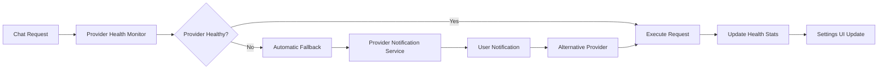
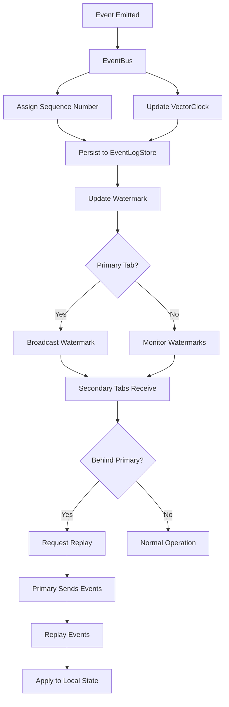
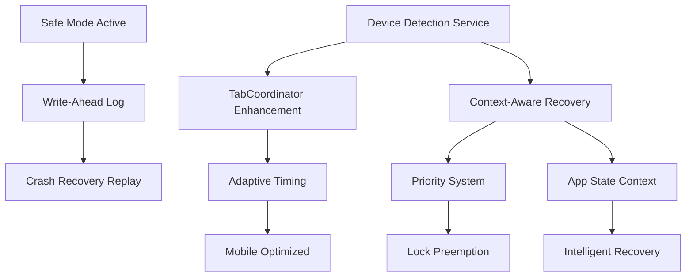
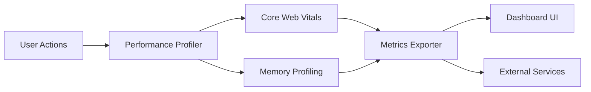
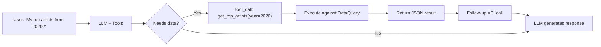
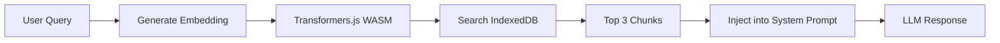

# Technical Architecture

## The Insight: Zero-Backend is Our Moat

**Everything runs on the user's device by default.** This isn't just cost-saving—it's a competitive advantage against server-dependent competitors like Stats.fm.

| Component | Cost | Who Pays | Competitive Advantage |
|-----------|------|----------|----------------------|
| LLM inference | $0 | **Your local AI** (Ollama/LM Studio) or OpenRouter (free tier) | **No cloud dependency** - run AI on your own hardware |
| Processing | $0 | User's browser | Privacy-first, no data breach risk |
| Data storage | $0 | User's localStorage/IndexedDB | User controls their data, not us |
| **Supporter Features** | **$39 one-time OR $19 first year, then $9/year** | **(Future)** User pays for PKM Export + Friend Compare | **One-time unlock**—no recurring infrastructure |
| **Patreon Perks** | **$7/month** | **(Future)** Discord access, voting, early beta | **Optional**—community engagement, not code access |
| **Total (Base)** | **$0** | **Free Forever** | Stats.fm needs to monetize to survive |

**Key Insight:** Stats.fm requires server infrastructure, which means:
- They must monetize to cover hosting costs
- They control your data
- They can shut down or change pricing
- You depend on their uptime

**Rhythm Chamber:** "Your data never leaves your device, runs in your browser, you control everything."

---

## Architecture: 100% Client-Side with Local AI

```
User's Browser
├── Two Onboarding Paths:
│   ├── Path A: Quick Snapshot (Spotify OAuth)
│   │   ├── PKCE auth flow (no backend)
│   │   ├── Fetch recent plays & top artists
│   │   └── Lite personality analysis
│   │
│   └── Path B: Full Analysis (File Upload)
│       ├── Upload .zip
│       ├── Parse JSON (Web Worker)
│       └── Full personality classification
│
│── Store in localStorage/IndexedDB
│── Chat via **Your AI** (Local or Cloud)
│   ├── **Local AI**: Ollama (http://localhost:11434)
│   ├── **Local AI**: LM Studio (http://localhost:1234/v1)
│   └── **Cloud AI**: OpenRouter (optional, BYOI with your key)
└── Generate shareable cards (Canvas + Web Share API)

Your "backend":
└── Static HTML/JS files only (no serverless needed)
```

**This architecture is a feature, not a bug.** For the quantified-self crowd, this is hugely compelling.

---

## Bring Your Own Intelligence (BYOI)

### Why BYOI > BYOK

**Traditional BYOK (keys-only cloud):**
- Users provide cloud API keys (OpenRouter, OpenAI)
- Data leaves the device
- Ongoing API costs
- Privacy concerns

**Our BYOI (you own the intelligence path):**
- **Local models**: Ollama, LM Studio (100% private, keyless)
- **Cloud models**: OpenRouter (optional, user-controlled)
- **Vector stores**: 100% local embeddings with IndexedDB
- **Cost control**: Choose free local, free cloud, or premium as needed

### Supported Intelligence Providers

| Provider | Type | Setup | Cost | Privacy | Best For |
|----------|------|-------|------|---------|----------|
| **Ollama** | Local | Install + download model | $0 | ⭐⭐⭐⭐⭐ | Maximum privacy, no internet needed |
| **LM Studio** | Local | Install + load model | $0 | ⭐⭐⭐⭐⭐ | User-friendly local AI GUI |
| **OpenRouter** | Cloud | API key | $0-$varies | ⭐⭐ | Convenience, premium models |

### Local AI Setup

**Ollama:**
```bash
# Install Ollama
curl -fsSL https://ollama.ai/install.sh | sh

# Download a recommended model
ollama pull llama3.2
ollama pull mistral

# Start server
ollama serve
```

**LM Studio:**
1. Download from lmstudio.ai
2. Install and launch
3. Download model from Hugging Face
4. Start local server (port 1234)

**Rhythm Chamber automatically detects and connects to local AI servers.**

---

## Modular Architecture (Refactored - HNW Compliant)

### Legacy Window Globals (Debug-Only)
- Window globals remain for backward compatibility while UI/controllers finish migrating to pure ES modules and `ModuleRegistry`.
- They are considered deprecated; new code should import modules directly instead of reaching for `window.X`.
- In development, any access to these globals logs a warning via `js/window-globals-debug.js` to catch accidental usage early.
- `npm run lint:globals` fails CI if new window globals are introduced; update the allowlist only when removing legacy globals.

### The Refactoring: From God Objects to Modular Architecture

**Before:** 3,426 lines in 3 God objects (app.js: 1,426, chat.js: 1,486, storage.js: 514)
**After:** ~2049 lines in 1 orchestrator + 7 focused modules + 3 services + 7 controllers
**Improvement:** **Significant reduction in complexity and better organization**

### 1. Storage Facade Pattern
`js/storage.js` acts as a unified entry point, delegating to specialized backends:
- **IndexedDBCore** (`js/storage/indexeddb.js`): Raw database operations
- **ConfigAPI** (`js/storage/config-api.js`): Key-value store for settings and tokens
- **Migration** (`js/storage/migration.js`): One-way migration from localStorage
- **ProfileStorage** (`js/storage/profiles.js`): Profile CRUD operations (extracted for HNW single-responsibility)

### 2. LLM Provider Interface
`js/chat.js` delegates all model interactions to `ProviderInterface` (`js/providers/provider-interface.js`), which routes to:
- **OpenRouter** (`js/providers/openrouter.js`): Cloud API
- **LM Studio** (`js/providers/lmstudio.js`): Local inference
- **Ollama** (`js/providers/ollama-adapter.js`): Local inference adapter

### 3. Controller Pattern (ENHANCED - 15 Controllers)
UI logic extracted from `app.js` into focused controllers:

#### Core Controllers (7)
- **ChatUIController** (`js/controllers/chat-ui-controller.js`): Message rendering, streaming, markdown
- **SidebarController** (`js/controllers/sidebar-controller.js`): Session list management
- **ViewController** (`js/controllers/view-controller.js`): Transitions and state
- **FileUploadController** (`js/controllers/file-upload-controller.js`): File processing (FIXED - race condition removed)
- **SpotifyController** (`js/controllers/spotify-controller.js`): Spotify OAuth flow
- **DemoController** (`js/controllers/demo-controller.js`): Demo mode
- **ResetController** (`js/controllers/reset-controller.js`): Reset operations

#### Advanced Controllers (NEW - 8)
- **MessageRenderer** (`js/controllers/message-renderer.js`): Advanced message rendering with artifacts
- **StreamingMessageHandler** (`js/controllers/streaming-message-handler.js`): Real-time streaming response handling
- **ChatInputManager** (`js/controllers/chat-input-manager.js`): Advanced input handling with validation
- **MessageActions** (`js/controllers/message-actions.js`): Message interaction handlers (regenerate, edit, delete)
- **ArtifactRenderer** (`js/controllers/artifact-renderer.js`): Data visualization and chart rendering
- **StreamingController** (`js/controllers/streaming-controller.js`): Stream coordination and buffering
- **ErrorBoundaryController** (`js/controllers/error-boundary-controller.js`): Error handling and recovery
- **AnalyticsController** (`js/controllers/analytics-controller.js`): User behavior tracking and insights

### 4. Service Pattern (ENHANCED - 25+ Services)
Extracted from God objects into independent services:

#### Core Services (17)
- **MessageOperations** (`js/services/message-operations.js`): Message operations (regenerate, delete, edit, query context)
- **SessionManager** (`js/services/session-manager.js`): Session lifecycle (create, load, save, delete)
- **TabCoordinator** (`js/services/tab-coordination.js`): Cross-tab coordination (ENHANCED - heartbeat failover)
- **TokenCountingService** (`js/services/token-counting-service.js`): Token counting & context window management
- **ToolCallHandlingService** (`js/services/tool-call-handling-service.js`): Tool call handling (ENHANCED - strategy voting)
- **LLMProviderRoutingService** (`js/services/llm-provider-routing-service.js`): LLM provider configuration & routing
- **FallbackResponseService** (`js/services/fallback-response-service.js`): Fallback response generation
- **StateMachineCoordinator** (`js/services/state-machine-coordinator.js`): Cross-controller state transitions (NEW)
- **LockPolicyCoordinator** (`js/services/lock-policy-coordinator.js`): Operation conflict matrix (NEW)
- **TimeoutBudgetManager** (`js/services/timeout-budget-manager.js`): Hierarchical timeout allocation (NEW)
- **TurnQueue** (`js/services/turn-queue.js`): Message serialization (NEW)
- **EventBus** (`js/services/event-bus.js`): Centralized typed event system (Phase 1)
- **PatternStream** (`js/services/pattern-stream.js`): Incremental pattern display (Phase 1)
- **ProfileSharing** (`js/services/profile-sharing.js`): Encrypted profile export/import (Phase 2)
- **PatternComparison** (`js/services/pattern-comparison.js`): Collaborative analysis engine (Phase 2)
- **TemporalAnalysis** (`js/services/temporal-analysis.js`): 5-year trend visualization (Phase 2)
- **PlaylistGenerator** (`js/services/playlist-generator.js`): AI playlist creation (Phase 2)

#### Enhanced Services (NEW - 8+)
- **LLMApiOrchestrator** (`js/services/llm-api-orchestrator.js`): Advanced LLM request routing with load balancing
- **MessageErrorHandler** (`js/services/message-error-handler.js`): Intelligent error classification and recovery
- **MessageValidator** (`js/services/message-validator.js`): Advanced message validation and sanitization
- **StreamProcessor** (`js/services/stream-parser.js`): Real-time stream processing and parsing
- **AdaptiveCircuitBreaker** (`js/services/adaptive-circuit-breaker.js`): Intelligent circuit breaker with adaptive thresholds
- **RetryManager** (`js/services/retry-manager.js`): Exponential backoff with jitter and circuit breaker integration
- **RateLimiter** (`js/services/rate-limiter.js`): Adaptive rate limiting with dynamic adjustment
- **SecurityService** (`js/services/security-service.js`): Enhanced security monitoring and protection

### 5. Utility Pattern (NEW - 13+ Utilities)
Specialized utilities for enhanced functionality and reliability:

#### Error Handling Utilities
- **ErrorHandlingUtils** (`js/utils/error-handling.js`): Comprehensive error classification and recovery
- **ErrorHandler** (`js/utils/error-handler.js`): Centralized error processing and logging

#### Retry & Resilience Utilities
- **RetryManager** (`js/utils/retry-manager.js`): Sophisticated retry with backoff and circuit breaker integration
- **ResilientRetry** (`js/utils/resilient-retry.js`): Enhanced retry patterns with adaptive strategies
- **AdaptiveRateLimiter** (`js/utils/adaptive-rate-limiter.js`): Dynamic rate limiting based on system conditions

#### Validation Utilities
- **ValidationUtils** (`js/utils/validation.js`): Advanced input validation and sanitization
- **SchemaRegistry** (`js/utils/schema-registry.js`): Centralized schema management and validation
- **FunctionValidator** (`js/utils/function-validator.js`): Runtime function validation and type checking

#### Processing Utilities
- **StreamBuffer** (`js/utils/stream-buffer.js`): Efficient stream buffering and management
- **ParserUtils** (`js/utils/parser.js`): Advanced data parsing and transformation
- **FunctionExecutor** (`js/utils/function-executor.js`): Safe function execution with timeout and error handling
- **SemanticExecutors** (`js/utils/semantic-executors.js`): Specialized semantic query execution

### 6. State Management
- **AppState** (`js/state/app-state.js`): Centralized state with demo isolation

### 7. Enhanced Error Handling & Reliability System (NEW)
Advanced error handling and resilience patterns for improved user experience:

#### Architecture Overview
The enhanced error handling system provides:
- **Intelligent Error Classification**: Automatic categorization of errors (network, API, validation, user input)
- **Circuit Breaker Patterns**: Prevent cascade failures with adaptive thresholds
- **Exponential Backoff Retry**: Smart retry with jitter and circuit breaker integration
- **Graceful Degradation**: Fallback responses when services are unavailable
- **User-Friendly Error Messages**: Context-aware error guidance and actionable suggestions
- **Error Recovery**: Automatic recovery mechanisms for common failure scenarios

#### Key Components
- **Adaptive Circuit Breaker**: Monitors service health and opens circuits when failure rates exceed thresholds
- **Retry Manager**: Implements exponential backoff with jitter, maximum retry limits, and timeout management
- **Error Handler**: Centralized error processing with classification, logging, and recovery strategies
- **Message Validator**: Real-time input validation with sanitization and error prevention
- **Rate Limiter**: Adaptive rate limiting based on system conditions and user behavior

#### Integration Points
- **Controllers**: Error boundaries catch and handle UI errors gracefully
- **Services**: Automatic retry and fallback for API calls
- **Utilities**: Comprehensive error handling across all operations
- **User Interface**: Real-time error indicators and recovery options

### 8. Enhanced Streaming & Artifact Processing (NEW)
Advanced streaming capabilities with real-time data visualization:

#### Streaming Enhancements
- **Real-time Message Streaming**: Smooth streaming responses with proper buffering
- **Stream Processing**: Incremental parsing and processing of streaming data
- **Message Rendering**: Advanced rendering with markdown support and artifact display
- **Error Recovery**: Automatic recovery from streaming interruptions

#### Artifact Processing
- **Data Visualization**: Chart rendering for analytics and insights
- **Artifact Renderer**: Intelligent display of charts, graphs, and visual elements
- **Streaming Controller**: Coordinates multiple streams with proper synchronization
- **Message Actions**: Advanced message interactions with real-time updates

### 9. Main Controller (app.js)
**New Structure:** ~1064 lines (vs 1,426 original) - **~25% reduction!**

**Responsibilities:**
- Initialization orchestration
- Event listener setup
- Delegation to services/controllers
- Global exports

**Key Improvements:**
- ✅ **~25% reduction in complexity** (~1064 vs 1,426 lines)
- ✅ **Clean modular architecture** - All UI logic delegated to ChatUIController
- ✅ **Proper dependency injection** - All controllers initialized with dependencies
- ✅ **Clear delegation pattern** - Direct calls to controllers/services
- ✅ **Runtime assumes modules are loaded via dependent imports; initialization validation** - `checkDependencies()` runs during startup to verify critical modules, and steady-state execution omits additional defensive checks
- ✅ **Event Delegation** - Single handler for all `data-action` UI events (replacing inline `onclick`)

### 7. Chat Module (chat.js)
**New Structure:** ~985 lines (vs 1,486 original) - **33% reduction!**

**Responsibilities:**
- Chat orchestration
- Session management (delegates to SessionManager)
- Message operations (delegates to MessageOperations)
- LLM provider routing (delegates to LLMProviderRoutingService)
- Tool execution (delegates to ToolCallHandlingService)
- Token counting (delegates to TokenCountingService)
- Fallback responses (delegates to FallbackResponseService)

**Key Improvements:**
- ✅ **33% reduction in complexity** (985 vs 1,486 lines)
- ✅ **Delegates to 4 dedicated services** for specialized concerns
- ✅ **Cleaner separation** of concerns
- ✅ **Maintains backward compatibility** with fallbacks
- ✅ **Under 1000 lines** - Achieved target!

### 8. Tool Strategy Pattern (NEW)
Extracted complex function calling logic from `chat.js` into dedicated strategies (`js/services/tool-strategies/`):

- **BaseToolStrategy**: Shared logic (Circuit Breaker, Timeout, Session access)
- **NativeToolStrategy** (Level 1): Handles standard OpenAI `tool_calls`
- **PromptInjectionStrategy** (Level 2/3): Parses `<function_call>` tags from text
- **IntentExtractionStrategy** (Level 4): Extracts user intent for direct function execution

**Benefits:**
- Reduces `handleToolCallsWithFallback` complexity (~200 lines → ~30 lines)
- Isolates parsing logic for different fallback levels
- Makes adding new fallback methods easier
- Improves testability of individual strategies

### 9. IoC Container Pattern (NEW)

The application uses a custom IoC (Inversion of Control) Container for dependency injection:

```javascript
// Service Registration
container.register('Storage', () => new Storage());
container.register('AppState', () => new AppState());

// Controller Initialization with Auto-wiring
const chatController = new ChatUIController({
  chat: container.resolve('Chat'),
  artifacts: container.resolve('Artifacts')
});
```

**Benefits:**
- Centralized dependency management
- Easier testing with mock injection
- Clear dependency graph
- Singleton service lifecycle

---

## HNW Patterns Addressed

### Hierarchy
- **Clear chain of command**: App → Controller → Service → Provider
- **Dependency injection**: All modules receive dependencies explicitly
- **Single responsibility**: Each module has one clear purpose

### Network
- **Modular communication**: Reduced "God Object" interconnectivity
- **Facade pattern**: Unified interfaces hide complexity
- **Event-driven**: Services communicate through events, not direct coupling

### Wave
- **Deterministic leader election**: 300ms window, lowest ID wins
- **Heartbeat failover**: 5s heartbeat, 10s promotion threshold (NEW)
- **Pattern Worker Pool Heartbeat**: Bidirectional liveness checks with automatic restart of stale workers (NEW)
- **Async/sync separation**: visibilitychange (async) vs beforeunload (sync)
- **Migration isolation**: Runs atomically before app initialization
- **Migration checkpointing**: Resume from last checkpoint on crash recovery (NEW)

### 9. HNW Structural Improvements (NEW)
Comprehensive structural improvements based on HNW framework analysis:

**Hierarchy Improvements:**
| Module | File | Purpose |
|--------|------|---------|
| State Machine Coordinator | `js/services/state-machine-coordinator.js` | Validated state transitions across controllers |
| Lock Policy Coordinator | `js/services/lock-policy-coordinator.js` | Conflict matrix for concurrent operations |
| Timeout Budget Manager | `js/services/timeout-budget-manager.js` | Hierarchical timeout allocation |

**Network Improvements:**
| Module | File | Purpose |
|--------|------|---------|
| Storage Transaction Layer | `js/storage/transaction.js` | Atomic commit/rollback across backends |
| Tab Heartbeat | `js/services/tab-coordination.js` | Leader health monitoring (5s heartbeat) |
| Strategy Voting | `js/services/tool-call-handling-service.js` | Confidence-based strategy selection |

**Wave Improvements:**
| Module | File | Purpose |
|--------|------|---------|
| Turn Queue | `js/services/turn-queue.js` | Sequential message processing |
| Pattern Worker Pool | `js/workers/pattern-worker-pool.js` | Parallel pattern detection (3 workers) with heartbeat monitoring |
| Pattern Worker | `js/workers/pattern-worker.js` | Pattern detection worker with heartbeat response support |
| Migration Checkpointing | `js/storage/migration.js` | Resumable migrations with progress |
| Hybrid Checkpoint Storage | `js/embeddings/embeddings-task-manager.js` | Split metadata→localStorage + texts→IndexedDB (prevents 5MB quota exceeded) |

---

## Provider Health Monitoring & Automatic Fallback (Phase 6)

### Overview

The Provider Health Monitoring system delivers real-time visibility into AI provider health with automatic fallback capabilities. Users get instant feedback on provider status and the system automatically switches to alternative providers when issues occur, ensuring continuous chat functionality.



### Core Components

#### 1. Provider Health Monitor (`js/services/provider-health-monitor.js`)
Real-time health tracking with 2-second update intervals:

| Feature | Description | Benefit |
|---------|-------------|---------|
| **Health Status Tracking** | Monitors success rates, latency, failures per provider | Identify degrading providers before they fail |
| **Circuit Breaker Integration** | Coordinates with circuit breaker state | Prevents cascade failures |
| **Real-time UI Updates** | Pushes health updates to settings modal | Users see live provider status |
| **Recommended Actions** | Suggests provider switches based on health | Proactive problem resolution |

**Health Status Levels:**
- `healthy`: Provider functioning normally (>80% success rate, <5s latency)
- `degraded`: Provider slow but functional (50-80% success rate or >5s latency)
- `unhealthy`: Provider failing (<50% success rate)
- `blacklisted`: Provider temporarily unavailable (circuit breaker open)
- `unknown`: Provider status not yet determined

#### 2. Provider Notification Service (`js/services/provider-notification-service.js`)
User-friendly notifications with actionable guidance:

| Notification Type | Trigger | User Action |
|------------------|---------|-------------|
| **Provider Fallback** | Automatic provider switch | "Switch back to [Provider]" button |
| **Provider Recovered** | Provider returns to healthy | "Switch to [Provider]" button |
| **Provider Blacklisted** | Circuit breaker opens | Shows expiry time + alternatives |
| **Provider Error** | Request fails | Provider-specific troubleshooting steps |

**Provider-Specific Error Guidance:**
- **Ollama**: "Start Ollama with `ollama serve`" for connection errors
- **LM Studio**: "Start the server in LM Studio (↔️ button)" for connection errors
- **OpenRouter**: "Check your API key in Settings" for authentication errors

#### 3. Enhanced Settings UI
Real-time provider health indicators in settings modal:

```html
<div class="provider-health-section">
    <div class="provider-health-header">
        <span class="provider-health-title">Provider Health Status</span>
        <span class="provider-health-badge healthy">Healthy</span>
    </div>
    <div class="provider-health-list">
        <!-- Real-time health per provider with metrics -->
        <div class="provider-health-item">
            <span class="status-dot healthy"></span>
            <span>Ollama (Local)</span>
            <span>⏱️ 234ms</span>
            <span>✅ 45</span>
        </div>
    </div>
    <div class="provider-health-recommendation">
        <strong>Recommendation:</strong> All providers operating normally
    </div>
</div>
```

### Automatic Provider Fallback

The system automatically tries alternative providers when the current provider fails:

**Fallback Priority:**
1. **OpenRouter** (Primary cloud provider)
2. **LM Studio** (Local inference)
3. **Ollama** (Local inference)
4. **Fallback Mode** (Static responses)

**Fallback Behavior:**
- Transparent switching with user notification
- Maintains conversation context across provider changes
- Tracks fallback reasons for debugging
- Recommends returning to preferred provider when recovered

### Integration Points

#### Chat Integration
```javascript
// Health monitoring is automatic - no chat changes needed
// Provider fallback happens transparently
ProviderFallbackChain.executeWithFallback({
    provider: 'ollama',
    messages: chatMessages,
    tools: functionTools
})
```

#### Settings Integration
```javascript
// Initialize health monitoring when settings opens
function showSettingsModal() {
    initProviderHealthMonitoring();
    // Health UI updates automatically every 2 seconds
}

function hideSettingsModal() {
    // Stop monitoring when settings closes to save resources
    ProviderHealthMonitor.stopMonitoring();
}
```

### Testing & Validation

Comprehensive test coverage with 60 tests across both services:

**Provider Health Monitor Tests (30 tests):**
- Initialization and health data management
- Health status mapping and circuit breaker integration
- UI callbacks and recommended actions
- Health summary calculation and monitoring lifecycle
- Data privacy and immutability

**Provider Notification Service Tests (30 tests):**
- Event subscription and notification types
- Provider fallback, recovery, and blacklist handling
- Provider-specific error messages and guidance
- Notification history and enable/disable functionality
- Toast integration and severity icons

### User Experience Benefits

**Before Phase 6:**
- ❌ Silent provider failures with cryptic error messages
- ❌ Manual provider switching required
- ❌ No visibility into provider health
- ❌ Difficult troubleshooting

**After Phase 6:**
- ✅ Real-time provider health indicators
- ✅ Automatic fallback with user notifications
- ✅ Provider-specific error guidance
- ✅ One-click provider switching
- ✅ Proactive health recommendations

### Performance Impact

**Minimal Overhead:**
- Health monitoring: <1% CPU (2-second polling interval)
- Memory usage: ~2MB for health data storage
- Network impact: None (uses existing provider requests)
- UI updates: Efficient DOM updates with dirty checking

**Resource Management:**
- Health monitoring stops when settings modal closes
- Notification history limited to 50 entries
- UI callbacks properly cleaned up
- No memory leaks in long-running sessions

---

## Event Replay System (NEW - Phase 7)

### Architecture Overview

The Event Replay System provides persistent event logging, cross-tab coordination, and causal ordering for events across browser tabs. This enables tabs to catch up automatically after disconnection, ensures consistent event ordering, and provides a foundation for advanced features like collaborative analysis and error replay.



### Core Components

#### 1. Event Log Store (`js/storage/event-log-store.js`)
IndexedDB-backed persistent storage for event replay and recovery:

| Feature | Description | Benefit |
|---------|-------------|---------|
| **Persistent Storage** | IndexedDB-backed event log | Survives page refreshes and tab crashes |
| **Automatic Compaction** | Compacts at 10,000 events | Prevents unbounded log growth |
| **Checkpoint System** | Creates checkpoints for rapid replay | Fast catch-up from known good states |
| **VectorClock Ordering** | Causal event relationships | Consistent ordering across tabs |
| **High-Resolution Timestamps** | `performance.now()` for precise ordering | Sub-millisecond event ordering |
| **Conflict Resolution** | Last-write-wins with timestamp ordering | Deterministic conflict handling |
| **Circuit Breaker** | 1000 events/hour limit | Prevents event storms |

**Event Schema:**
```javascript
{
    id: 'uuid-v4',
    type: 'EVENT_TYPE',
    payload: { /* event data */ },
    sequenceNumber: 42,
    vectorClock: { tab1: 5, tab2: 3 },
    timestamp: 1234567890.123,  // performance.now()
    wallClockTime: 1705569600000, // Date.now()
    metadata: {
        source: 'tab-id',
        priority: 1,
        domain: 'user-data'
    }
}
```

**Key APIs:**
- `initEventLogStores()` - Initialize IndexedDB stores
- `appendEvent(event)` - Add event to log
- `getEvents({ fromSequenceNumber, count, forward })` - Query events
- `createCheckpoint(label)` - Create checkpoint for rapid replay
- `getLatestCheckpoint()` - Get most recent checkpoint
- `compactEventLog()` - Compact old events (preserves checkpoints)
- `getEventLogStats()` - Get event log statistics

#### 2. EventBus Extensions (`js/services/event-bus.js`)
Enhanced with event versioning and replay capabilities:

| Feature | Description | Benefit |
|---------|-------------|---------|
| **Event Versioning** | Monotonically increasing sequence numbers | Track event order |
| **VectorClock Integration** | Causal ordering metadata | Detect concurrent events |
| **Event Watermark** | Track processed event sequence | Enable catch-up replay |
| **Replay APIs** | Forward/reverse replay from log | Debug and recovery |
| **Replay Detection** | `isReplay` flag in metadata | Distinguish original vs replayed |
| **Event Log Control** | Enable/disable logging, skip option | Control what gets logged |

**Enhanced Event Metadata:**
```javascript
{
    type: 'EVENT_TYPE',
    sequenceNumber: 42,
    vectorClock: { tab1: 5, tab2: 3 },
    timestamp: 1234567890.123,
    priority: 1,
    domain: 'user-data',
    isReplay: false,
    source: 'tab-id'
}
```

**New APIs:**
- `replayEvents({ fromSequenceNumber, count, forward })` - Replay events from log
- `enableEventLog(bool)` - Enable/disable event logging
- `isEventLogEnabled()` - Check if logging is enabled
- `setEventWatermark(sequence)` - Set current watermark
- `getEventWatermark()` - Get current watermark
- `getEventLogStats()` - Get event log statistics
- `clearEventLog()` - Clear all logged events

#### 3. TabCoordinator Enhancements (`js/services/tab-coordination.js`)
Enhanced with watermark tracking and replay coordination:

| Feature | Description | Benefit |
|---------|-------------|---------|
| **Watermark Tracking** | Track processed event sequence per tab | Detect lagging tabs |
| **Replay Detection** | `needsReplay()` checks if behind primary | Automatic catch-up |
| **Replay Coordination** | Request/servce replay via BroadcastChannel | Cross-tab event sync |
| **Auto-Replay** | `autoReplayIfNeeded()` on tab activation | Seamless tab switch |
| **Watermark Broadcast** | Periodic broadcasts (5-second interval) | Real-time sync status |

**New Message Types:**
- `EVENT_WATERMARK` - Primary broadcasts current watermark
- `REPLAY_REQUEST` - Secondary requests events from watermark
- `REPLAY_RESPONSE` - Primary sends event batch

**New APIs:**
- `updateEventWatermark(sequence)` - Update local watermark
- `getEventWatermark()` - Get local watermark
- `getKnownWatermarks()` - Get all tab watermarks
- `needsReplay()` - Check if replay needed
- `requestEventReplay(fromWatermark)` - Request catch-up
- `autoReplayIfNeeded()` - Automatic replay on lag
- `handleReplayRequest(tabId, fromWatermark)` - Primary serves events
- `handleReplayResponse(events)` - Secondary applies events

### Cross-Tab Replay Coordination

**Watermark Broadcast (Primary → Secondary):**
```javascript
// Primary tab broadcasts watermark every 5 seconds
setInterval(() => {
    if (isPrimaryTab) {
        const watermark = EventBus.getEventWatermark();
        broadcastChannel.postMessage({
            type: 'EVENT_WATERMARK',
            tabId: currentTabId,
            watermark: watermark
        });
    }
}, 5000);
```

**Replay Request (Secondary → Primary):**
```javascript
// Secondary detects it's behind and requests replay
if (TabCoordinator.needsReplay()) {
    const fromWatermark = TabCoordinator.getEventWatermark();
    broadcastChannel.postMessage({
        type: 'REPLAY_REQUEST',
        tabId: currentTabId,
        fromWatermark: fromWatermark
    });
}
```

**Replay Response (Primary → Secondary):**
```javascript
// Primary fetches events and sends to requesting tab
async function handleReplayRequest(requestingTabId, fromWatermark) {
    const events = await EventLogStore.getEvents({
        fromSequenceNumber: fromWatermark,
        count: 1000,
        forward: true
    });

    broadcastChannel.postMessage({
        type: 'REPLAY_RESPONSE',
        tabId: currentTabId,
        targetTabId: requestingTabId,
        events: events
    });
}
```

### VectorClock for Causal Ordering

**What is VectorClock?**
- A distributed algorithm for capturing causal relationships between events
- Each tab maintains a vector clock (counter per tab)
- Enables detection of concurrent events and conflicts

**VectorClock Operations:**
```javascript
// Tick local clock (event emitted)
const vectorClock = new VectorClock();
vectorClock.tick(); // { tab1: 1 }

// Merge with another clock (receive event from another tab)
vectorClock.merge({ tab2: 1 }); // { tab1: 1, tab2: 1 }

// Compare clocks (check event ordering)
vectorClock.compare({ tab1: 1, tab2: 2 }); // Returns: 'before'
```

**Causal Relationship Detection:**
- `before`: Event A causally precedes Event B
- `after`: Event A causally follows Event B
- `concurrent`: Events are concurrent (no causal relationship)

### Event Replay Flow

**Forward Replay (Latest → Earliest):**
```javascript
const result = await EventBus.replayEvents({
    fromSequenceNumber: 100,
    count: 50,
    forward: true
});
// Returns: { replayed: 50, errors: 0, lastSequenceNumber: 150 }
```

**Reverse Replay (Earliest → Latest):**
```javascript
const result = await EventBus.replayEvents({
    fromSequenceNumber: 150,
    count: 50,
    forward: false
});
// Returns: { replayed: 50, errors: 0, lastSequenceNumber: 100 }
```

**Checkpoint-Based Replay:**
```javascript
// Create checkpoint
await EventLogStore.createCheckpoint('before-migration');

// Later, replay from checkpoint
const checkpoint = await EventLogStore.getLatestCheckpoint();
await EventBus.replayEvents({
    fromSequenceNumber: checkpoint.sequenceNumber
});
```

### Automatic Compaction

**Compaction Strategy:**
- **Trigger**: 10,000 events in log
- **Preservation**: Checkpoints always preserved
- **Cleanup**: Events older than latest checkpoint removed
- **Optimization**: IndexedDB compaction after cleanup

**Compaction Flow:**
```javascript
async function compactEventLog() {
    const stats = await EventLogStore.getEventLogStats();
    if (stats.totalEvents >= 10000) {
        const checkpoint = await EventLogStore.getLatestCheckpoint();
        await EventLogStore.compactEventLog(checkpoint.sequenceNumber);
    }
}
```

### Integration Points

**EventBus Integration:**
```javascript
// All events automatically versioned
EventBus.emit('DATA_STREAMS_LOADED', { streams: [] });
// Metadata: { sequenceNumber: 42, vectorClock: {...}, isReplay: false }
```

**TabCoordinator Integration:**
```javascript
// Watermark broadcast integrated with heartbeat
setInterval(() => {
    if (isPrimaryTab) {
        sendHeartbeat();
        broadcastWatermark(); // New
    }
}, 5000);
```

**Error Recovery Integration:**
```javascript
// Replay error events for debugging
await EventBus.replayEvents({
    fromSequenceNumber: errorWatermark,
    count: 100
});
```

### Testing & Validation

Comprehensive test coverage with 75+ tests across 3 test files:

**Event Log Store Tests (30+ tests):**
- Event storage and retrieval
- Sequence numbering and ordering
- VectorClock integration
- Checkpoint creation and restoration
- Compaction and cleanup
- Error handling and edge cases

**EventBus Replay Tests (25+ tests):**
- Event versioning (sequence numbers, VectorClock)
- Watermark tracking
- Event log control (enable/disable, skip)
- Replay APIs (forward/reverse)
- Integration with existing EventBus
- Edge cases (no subscribers, rapid emission)

**TabCoordinator Watermark Tests (20+ tests):**
- Watermark tracking and updates
- Replay detection and coordination
- Cross-tab message handling
- Auto-replay on lag detection
- Mock BroadcastChannel for isolated testing

### HNW Framework Alignment

**Hierarchy:**
- **Clear Authority**: Primary tab responsible for event log and serving replays
- **Single Source of Truth**: EventLogStore as authoritative event history
- **Delegation**: TabCoordinator delegates replay coordination to primary/secondary roles

**Network:**
- **Decoupled Communication**: BroadcastChannel enables cross-tab coordination without coupling
- **Event-Driven Coordination**: Watermark broadcasts trigger automatic catch-up
- **Causal Ordering**: VectorClock ensures consistent event ordering across tabs

**Wave:**
- **Deterministic Timing**: 5-second watermark broadcast interval
- **Progressive Catch-up**: Replay events in batches to maintain UI responsiveness
- **Storm Protection**: Circuit breaker prevents runaway event logging

### Performance Impact

**Minimal Overhead:**
- Event logging: <2% CPU (async IndexedDB writes)
- Memory usage: ~5MB for 10,000 events
- Watermark broadcast: 5-second interval (negligible)
- Replay catch-up: Batched (1000 events per request)

**Resource Management:**
- Automatic compaction at 10,000 events
- Checkpoint preservation for rapid replay
- Circuit breaker prevents event storms
- Efficient IndexedDB queries with indexes

### User Experience Benefits

**Before Phase 7:**
- ❌ Tabs can't catch up after disconnection
- ❌ Event ordering inconsistencies across tabs
- ❌ No event history for debugging
- ❌ Manual page refresh required to sync state

**After Phase 7:**
- ✅ Automatic catch-up for late-joining tabs
- ✅ Consistent event ordering via VectorClock
- ✅ Persistent event log for debugging and replay
- ✅ Seamless cross-tab coordination
- ✅ Foundation for collaborative features

### Future Enhancements

- **Error Event Replay**: Replay error events for debugging and analysis
- **Event Export/Import**: Export event log for external analysis
- **Configurable Compaction**: User-adjustable compaction thresholds
- **Metrics Dashboard**: Event log health monitoring UI
- **Collaborative Replay**: Multi-user event replay for shared sessions
- **Event Filtering**: Replay only specific event types or domains

---

## Phase 7: Mobile Reliability & Safe Mode Enhancements (NEW)

### Architecture Overview

Phase 7 delivers three critical improvements for mobile devices, Safe Mode durability, and intelligent error recovery. These systems work together to provide a robust, adaptive experience across all device types and network conditions while ensuring data durability during security failures.



### Core Components

#### 1. Device Detection Service (`js/services/device-detection.js`)

Mobile device detection, network monitoring, and adaptive timing recommendations:

| Feature | Description | Benefit |
|---------|-------------|---------|
| **Device Type Detection** | PHONE, TABLET, DESKTOP classification | Mobile-aware behavior |
| **Device Capability Levels** | HIGH, MEDIUM, LOW based on hardware | Resource-aware operations |
| **Network Quality Monitoring** | EXCELLENT, GOOD, FAIR, POOR tracking | Network-adaptive operations |
| **Visibility State Tracking** | Page visibility API integration | Background tab handling |
| **Adaptive Timing** | Device and network-based timing config | Optimized performance |
| **Heartbeat Quality** | Throttling detection via quality metrics | Battery optimization |

**Device Detection APIs:**
```javascript
// Device type detection
DeviceDetection.detectDeviceType()           // → 'PHONE' | 'TABLET' | 'DESKTOP'
DeviceDetection.isMobile()                   // → boolean
DeviceDetection.isPhone()                    // → boolean
DeviceDetection.getDeviceInfo()             // → { type, capability, userAgent, screenSize, cores, memory }

// Network monitoring
DeviceDetection.getConnectionQuality()       // → 'EXCELLENT' | 'GOOD' | 'FAIR' | 'POOR'
DeviceDetection.isNetworkDegraded()          // → boolean
DeviceDetection.isOnline()                   // → boolean
DeviceDetection.onNetworkChange(callback)    // → Register network change listener

// Adaptive timing
DeviceDetection.getAdaptiveTiming()          // → { heartbeat: {...}, election: {...} }
DeviceDetection.getRecommendedVisibilityWait() // → Adaptive wait time (5s-12s)

// Heartbeat quality
DeviceDetection.recordHeartbeatQuality(onTime, degraded)
DeviceDetection.getHeartbeatQualityStats()   // → { onTimeRate, degradedRate, lastDegraded, sampleCount }
```

**Adaptive Timing Configuration:**
```javascript
// Desktop, excellent network
{
    heartbeat: { intervalMs: 3000, maxMissed: 3 },
    election: { windowMs: 300 }
}

// Mobile, poor network
{
    heartbeat: { intervalMs: 8000, maxMissed: 5 },
    election: { windowMs: 800 }
}
```

#### 2. TabCoordinator Enhancement (`js/services/tab-coordination.js`)

Enhanced with DeviceDetection integration for mobile-aware coordination:

| Feature | Description | Benefit |
|---------|-------------|---------|
| **Adaptive Heartbeat** | Device and network-based timing | Mobile-optimized coordination |
| **Visibility-Aware Promotion** | Adaptive wait before promotion | Prevents premature promotion |
| **Network Failover** | Quality-based heartbeat adjustment | Resilient to network changes |
| **Heartbeat Quality Recording** | Throttling detection | Battery optimization |

**Key Changes:**
```javascript
// Initialize adaptive timing
function initAdaptiveTiming() {
    adaptiveTiming = DeviceDetection.getAdaptiveTiming();
    HEARTBEAT_INTERVAL_MS = adaptiveTiming.heartbeat.intervalMs;
    MAX_MISSED_HEARTBEATS = adaptiveTiming.heartbeat.maxMissed;
    ELECTION_WINDOW_MS = adaptiveTiming.election.windowMs;
}

// Adaptive visibility wait
const visibilityWaitMs = DeviceDetection.getRecommendedVisibilityWait();
setTimeout(async () => {
    const recentHeartbeat = clockSkewTracker.adjustTimestamp(Date.now()) - lastLeaderHeartbeat;
    if (recentHeartbeat > maxAllowedGap) {
        initiateReElection();
    }
}, visibilityWaitMs); // 5s desktop, 8s mobile, 12s poor network

// Network-based failover
function setupNetworkMonitoring() {
    DeviceDetection.onNetworkChange((quality) => {
        if (quality === 'poor' || quality === 'fair') {
            // Increase heartbeat interval on degraded network
            HEARTBEAT_INTERVAL_MS = 8000;
        } else {
            // Restore normal heartbeat
            HEARTBEAT_INTERVAL_MS = adaptiveTiming.heartbeat.intervalMs;
        }
    });
}
```

#### 3. Write-Ahead Log (`js/storage/write-ahead-log.js`)

Durable write queue and crash recovery for Safe Mode operations:

| Feature | Description | Benefit |
|---------|-------------|---------|
| **Write Queue** | Operations queued when encryption unavailable | No data loss in Safe Mode |
| **Persistent Log** | localStorage-backed operation log | Survives page crashes |
| **Automatic Replay** | Startup and encryption-available replay | Automatic recovery |
| **Cross-Tab Coordination** | Only primary tab processes WAL | No duplicate operations |
| **Adaptive Batching** | Device and network-based batching | Performance optimization |
| **Priority System** | CRITICAL, HIGH, NORMAL, LOW ordering | Critical operations first |

**WAL APIs:**
```javascript
// Initialization
await WriteAheadLog.init()                    // Initialize WAL system

// Write queue
await WriteAheadLog.queueWrite('saveStreams', [streams], WalPriority.HIGH)
await WriteAheadLog.queueWrite('savePersonality', [personality], WalPriority.CRITICAL)

// Processing
await WriteAheadLog.processWal()              // Process pending entries
await WriteAheadLog.replayWal()                // Replay on startup for crash recovery
WriteAheadLog.stopProcessing()                 // Stop WAL processing

// Monitoring
WriteAheadLog.getWalStats()                    // → { totalEntries, pending, processing, committed, failed }
WriteAheadLog.startMonitoring()                // Start cleanup monitoring
WriteAheadLog.stopMonitoring()                 // Stop monitoring

// Maintenance
WriteAheadLog.cleanupWal()                     // Cleanup old entries
WriteAheadLog.clearWal()                       // Clear all WAL entries
```

**WAL Entry Schema:**
```javascript
{
    id: '1705569600000-abc123',
    sequence: 42,
    operation: 'saveStreams',
    args: [[/* streams */]],
    priority: 'high',       // critical | high | normal | low
    status: 'pending',      // pending | processing | committed | failed
    createdAt: 1705569600000,
    processedAt: null,
    attempts: 0,
    error: null
}
```

**Processing Logic:**
```javascript
// Only primary tab processes WAL
async function processWal() {
    if (!TabCoordinator.isPrimary()) {
        console.log('[WAL] Skipping WAL processing - not primary tab');
        return;
    }

    // Sort by priority and sequence
    const sortedEntries = walState.entries
        .filter(entry => entry.status === WalStatus.PENDING || entry.status === WalStatus.FAILED)
        .sort((a, b) => {
            const priorityDiff = PRIORITY_ORDER[a.priority] - PRIORITY_ORDER[b.priority];
            if (priorityDiff !== 0) return priorityDiff;
            return a.sequence - b.sequence;
        });

    // Process in batches
    for (const entry of sortedEntries) {
        if (SafeMode.canEncrypt()) {
            const result = await executeOperation(entry.operation, entry.args);
            entry.status = WalStatus.COMMITTED;
        } else {
            entry.status = WalStatus.FAILED;
            entry.error = 'Encryption unavailable';
        }
    }
}
```

#### 4. Context-Aware Error Recovery (`js/context-aware-recovery.js`)

Intelligent error recovery with dynamic priorities and app state context:

| Feature | Description | Benefit |
|---------|-------------|---------|
| **Dynamic Priority System** | CRITICAL (100), HIGH (75), NORMAL (50), LOW (25) | Resource allocation |
| **Lock Preemption** | Higher priority can preempt lower priority | Critical operations first |
| **App State Context** | View mode, data state, user intent tracking | Context-aware decisions |
| **Intelligent Strategy Selection** | Error type and context-based recovery | Optimal recovery paths |
| **Context Monitoring** | Real-time app state updates | Adaptive recovery |

**Priority System:**
```javascript
const RecoveryPriority = {
    CRITICAL: 'critical',     // System integrity (security, data corruption)
    HIGH: 'high',            // User-visible operations (chat, upload)
    NORMAL: 'normal',        // Background tasks (analytics, sync)
    LOW: 'low'               // Optional tasks (cache, prefetch)
}

const PRIORITY_VALUES = {
    [RecoveryPriority.CRITICAL]: 100,
    [RecoveryPriority.HIGH]: 75,
    [RecoveryPriority.NORMAL]: 50,
    [RecoveryPriority.LOW]: 25
}
```

**Context-Aware Locks:**
```javascript
// Acquire priority lock with preemption support
const lockId = await ContextAwareRecovery.acquirePriorityLock(
    'file_processing',
    RecoveryPriority.HIGH
)

// Higher priority can preempt lower priority (>20 point difference)
if (priorityValue > currentValue + 20) {
    OperationLock.forceRelease(operationName, 'priority_preemption');
    await new Promise(resolve => setTimeout(resolve, 100));
}
```

**Recovery Strategy Selection:**
```javascript
// AUTH_FAILURE → High priority refresh token
{
    priority: 'high',
    action: 'refresh_token',
    reason: 'User-facing auth issue',
    canAutoRecover: true,
    requiresLock: 'spotify_fetch'
}

// STORAGE_QUOTA_EXCEEDED → Critical priority cleanup
{
    priority: 'critical',
    action: 'cleanup_storage',
    reason: 'Storage quota critical',
    canAutoRecover: true,
    requiresLock: 'privacy_clear'
}

// NETWORK_ERROR on poor network → Adaptive retry
{
    priority: 'normal',
    action: 'adaptive_retry',
    reason: 'Network degraded, using adaptive timing',
    canAutoRecover: true,
    adaptiveDelay: 5000  // Longer on mobile
}
```

### Integration Points

**Storage Integration:**
```javascript
// Storage facade initializes WAL
async init() {
    await window.IndexedDBCore.initDatabase({...});
    await StorageMigration.migrateFromLocalStorage();

    // Initialize Write-Ahead Log for Safe Mode
    await WriteAheadLog.init();

    return window.IndexedDBCore.getConnection();
}
```

**TabCoordinator Integration:**
```javascript
// Initialize adaptive timing on startup
function init() {
    initAdaptiveTiming();
    setupNetworkMonitoring();
    setupVisibilityMonitoring();

    // Rest of initialization...
}

function initAdaptiveTiming() {
    adaptiveTiming = DeviceDetection.getAdaptiveTiming();
    HEARTBEAT_INTERVAL_MS = adaptiveTiming.heartbeat.intervalMs;
    MAX_MISSED_HEARTBEATS = adaptiveTiming.heartbeat.maxMissed;
    ELECTION_WINDOW_MS = adaptiveTiming.election.windowMs;
}
```

**Context-Aware Recovery Integration:**
```javascript
// Start context monitoring on app initialization
ContextAwareRecovery.startContextMonitoring();

// Update context on view changes
EventBus.on('ui:view_changed', ({ view }) => {
    ContextAwareRecovery.updateAppStateContext({ viewMode: view });
});

// Use in error handling
try {
    await someOperation();
} catch (error) {
    const strategy = ContextAwareRecovery.selectRecoveryStrategy(error, context);
    await ContextAwareRecovery.executeRecovery(strategy);
}
```

### HNW Framework Alignment

**Hierarchy (Clear Chain of Command):**
- **Priority System**: CRITICAL → HIGH → NORMAL → LOW with numeric values (100, 75, 50, 25)
- **Lock Preemption**: Higher priority operations can preempt lower priority locks (>20 point difference)
- **Single Authority**: Only primary tab processes WAL and handles recovery
- **Dependency Injection**: All services accept dependencies via parameters

**Network (Modular Communication):**
- **Cross-Tab Coordination**: WAL processing coordinated via TabCoordinator
- **Event-Driven Updates**: App state context changes emitted via EventBus
- **Facade Pattern**: ContextAwareRecovery provides unified API for all recovery operations
- **BroadcastChannel**: Used for cross-tab WAL coordination

**Wave (Deterministic Timing):**
- **Adaptive Heartbeat**: 3s desktop, 5s mobile, 8s poor network
- **Adaptive Visibility Wait**: 5s desktop, 8s mobile, 12s poor network
- **Adaptive Batching**: WAL batch size based on device and network conditions
- **Progressive Processing**: Priority-based WAL processing (CRITICAL → HIGH → NORMAL → LOW)

### Performance Impact

**Minimal Overhead:**
- Device detection: <0.5% CPU (one-time detection, cached results)
- Network monitoring: <1% CPU (Network Information API)
- WAL processing: <2% CPU (adaptive batching)
- Context tracking: <0.5% CPU (event-driven updates)

**Resource Management:**
- WAL size limited to 100 entries
- WAL entries expire after 24 hours
- Committed entries cleaned up after 1 minute
- Heartbeat quality samples limited to 100

### User Experience Benefits

**Before Phase 7:**
- ❌ Fixed timing causes battery drain on mobile devices
- ❌ No operation durability in Safe Mode
- ❌ All errors handled equally regardless of context
- ❌ No priority-based resource allocation

**After Phase 7:**
- ✅ Mobile-optimized timing reduces battery usage
- ✅ WAL ensures operations survive crashes in Safe Mode
- ✅ Context-aware recovery provides intelligent error handling
- ✅ Priority system ensures critical operations take precedence
- ✅ Network-aware operations adapt to connection quality

### Testing & Validation

Comprehensive test coverage planned:
- Device detection accuracy across devices
- Network monitoring integration
- WAL persistence and replay
- Priority-based lock preemption
- Context-aware strategy selection
- Adaptive timing configuration

### Future Enhancements

- **Battery Status API**: More accurate battery monitoring
- **Configurable Priorities**: User-adjustable priority thresholds
- **WAL Metrics Dashboard**: Safe Mode operation monitoring
- **Cross-Tab Recovery**: Multi-user recovery coordination
- **Advanced Throttling Detection**: Machine learning-based detection

---

## Observability & Performance Monitoring (NEW - Phase 8)

### Architecture Overview

The observability system provides comprehensive performance monitoring and metrics collection while maintaining the 100% client-side architecture. Built with < 5% performance overhead, it enables real-time insights into application health and user experience.



### Core Components

#### 1. Core Web Vitals Tracker (`js/observability/core-web-vitals.js`)
Tracks Google's Core Web Vitals using PerformanceObserver API:

| Metric | Description | Good Threshold |
|--------|-------------|----------------|
| **CLS** (Cumulative Layout Shift) | Visual stability | < 0.1 |
| **FID** (First Input Delay) | Interactivity | < 100ms |
| **LCP** (Largest Contentful Paint) | Loading performance | < 2.5s |
| **INP** (Interaction to Next Paint) | Responsiveness | < 200ms |
| **TTFB** (Time to First Byte) | Server response | < 800ms |
| **FCP** (First Contentful Paint) | Initial paint | < 1.8s |

**Features:**
- PerformanceObserver-based automatic tracking
- 95th percentile aggregation for statistical accuracy
- Performance rating calculation (good/needs improvement/poor)
- JSON export functionality
- Real-time metric collection with configurable sampling

#### 2. Enhanced Performance Profiler (`js/services/performance-profiler.js`)
Upgraded from basic profiling to comprehensive performance monitoring:

**New Capabilities:**
- **Memory Profiling**: Chrome DevTools Memory API integration
- **Operation Duration Tracking**: Categorized performance measurements
- **Performance Budgets**: Configurable thresholds with alerts
- **Degradation Detection**: Automatic performance regression detection
- **Comprehensive Reporting**: Unified performance and health reports

**Performance Categories:**
```javascript
PerformanceCategory = {
    COMPUTATION: 'computation',           // Data processing operations
    STORAGE: 'storage',                   // IndexedDB/localStorage operations
    CHAT: 'chat',                        // LLM API calls and responses
    UI_RENDERING: 'ui_rendering',        // DOM updates and rendering
    PATTERN_DETECTION: 'pattern_detection', // Pattern algorithm execution
    EMBEDDING_GENERATION: 'embedding_generation', // Vector embedding creation
    SEMANTIC_SEARCH: 'semantic_search'   // Vector similarity search
}
```

**Key Features:**
- Memory snapshots with trend analysis
- Performance budget enforcement with degradation thresholds
- Baseline establishment for regression detection
- 95th/99th percentile calculations
- Automatic alert generation for threshold violations

#### 3. Metrics Export Framework (`js/observability/metrics-exporter.js`)
Provides flexible metrics export and integration capabilities:

**Export Formats:**
| Format | Use Case | Features |
|--------|----------|----------|
| **JSON** | Full metrics backup | Complete data structure |
| **CSV** | Spreadsheet analysis | Human-readable tabular format |
| **Prometheus** | Monitoring systems | Time-series format for Grafana |
| **InfluxDB** | Time-series databases | Line protocol format |

**Scheduled Exports:**
- **HOURLY**: Regular monitoring intervals
- **DAILY**: Daily performance snapshots
- **WEEKLY**: Weekly trend analysis
- **CUSTOM**: User-defined intervals

**External Service Integrations:**
- **DataDog**: Custom metrics submission
- **New Relic**: Insights integration
- **Prometheus Pushgateway**: Time-series push
- **Custom Endpoints**: Generic HTTP webhook support

**Features:**
- AES-GCM encryption for sensitive metrics
- Automatic retry with exponential backoff
- Configuration persistence via localStorage
- Job management (pause/resume/delete)

#### 4. Observability Controller (`js/controllers/observability-controller.js`)
Manages the performance monitoring dashboard UI:

**Dashboard Features:**
- **Real-time Metrics Display**: Live performance data updates
- **Tabbed Interface**: Organized by metric category
- **Performance Charts**: Visual trend analysis
- **Export Controls**: Immediate and scheduled export options
- **Memory Profiling Controls**: Start/stop memory profiling
- **Alert Management**: View and clear degradation alerts

**UI Components:**
- Performance overview cards
- Category-specific statistics
- Memory usage trends
- Web Vitals status indicators
- Export format selection
- Scheduled job management

### Performance Characteristics

#### Overhead Analysis
| Component | CPU Overhead | Memory Impact | Frequency |
|-----------|-------------|---------------|-----------|
| **Core Web Vitals** | < 0.1% | ~50KB | On metric events |
| **Performance Profiler** | < 2% | ~200KB | Per operation |
| **Memory Profiling** | < 1% | ~100KB | Configurable interval |
| **Metrics Export** | < 1% | ~500KB (temporary) | On demand/schedule |
| **Dashboard UI** | < 0.5% | ~100KB | User interaction |
| **Total** | **< 5%** | **< 1MB** | - |

#### Optimization Strategies
- **Lazy Loading**: Observability modules load on-demand
- **Sampling Config**: Adjustable metric collection frequency
- **Pruning**: Automatic cleanup of old measurements
- **Circuit Breakers**: Prevent runaway metric collection
- **Web Worker Offloading**: Heavy computation in background threads

### Integration Points

#### EventBus Integration
```javascript
// Observability events published to EventBus
EventBus.publish('observability:metric', {
    category: PerformanceCategory.COMPUTATION,
    duration: 150,
    metadata: { operation: 'pattern_detection' }
});

EventBus.publish('observability:degradation', {
    severity: 'warning',
    category: PerformanceCategory.STORAGE,
    details: { threshold: 100, actual: 180 }
});
```

#### Settings Integration
- Performance monitoring toggle
- Memory profiling controls
- Export format preferences
- Update interval configuration
- Scheduled job management

#### Existing Service Integration
- **Chat Operations**: LLM call timing
- **Storage Operations**: IndexedDB performance tracking
- **Pattern Detection**: Algorithm execution metrics
- **Embedding Generation**: Vector embedding performance
- **RAG Operations**: Semantic search timing

### Usage Examples

#### Basic Performance Tracking
```javascript
// Start operation timing
const stopOperation = PerformanceProfiler.startOperation('data_analysis', {
    category: PerformanceCategory.COMPUTATION
});

// ... perform operation ...
stopOperation(); // Automatically records duration

// Get statistics
const stats = PerformanceProfiler.getStatistics(PerformanceCategory.COMPUTATION);
console.log(`Average: ${stats.avgDuration}ms, P95: ${stats.p95Duration}ms`);
```

#### Memory Profiling
```javascript
// Take memory snapshot
const snapshot = PerformanceProfiler.takeMemorySnapshot();
console.log(`Memory usage: ${snapshot.usagePercentage}%`);

// Start automatic profiling
const stopProfiling = PerformanceProfiler.startMemoryProfiling(10000); // 10s interval

// Later: stop profiling
stopProfiling();
```

#### Performance Budgets
```javascript
// Set performance budget
PerformanceProfiler.setPerformanceBudget(PerformanceCategory.STORAGE, {
    threshold: 100, // 100ms
    action: 'warn',
    degradationThreshold: 50 // 50% increase triggers alert
});

// Check for alerts
const alerts = PerformanceProfiler.getDegradationAlerts();
alerts.forEach(alert => {
    console.log(`Alert: ${alert.message} (${alert.severity})`);
});
```

#### Metrics Export
```javascript
// Immediate export
await MetricsExporter.exportNow({
    format: ExportFormat.JSON,
    includeMemory: true,
    includeWebVitals: true
});

// Scheduled export
const jobId = MetricsExporter.createScheduledExport('daily-performance', {
    format: ExportFormat.PROMETHEUS,
    schedule: ScheduleType.DAILY,
    includeMemory: true,
    categories: ['computation', 'storage']
});
```

### Testing Coverage
Comprehensive test suites ensure reliability:

| Test Suite | Tests | Coverage |
|------------|-------|----------|
| **Core Web Vitals** | 370 tests | Metric collection, rating calculations, export |
| **Performance Profiler** | 508 tests | Memory profiling, budgets, degradation detection |
| **Metrics Exporter** | 462 tests | Export formats, scheduling, external services |
| **Total** | **1340 tests** | Comprehensive observability coverage |

### Configuration

#### Default Settings
```javascript
const defaultConfig = {
    // Core Web Vitals
    webVitalsEnabled: true,
    maxMetrics: 100,

    // Performance Profiler
    profilerEnabled: true,
    maxMeasurements: 1000,
    maxMemorySnapshots: 20,
    maxDegradationAlerts: 50,

    // Memory Profiling
    memoryProfilingEnabled: true,
    memoryProfilingInterval: 30000, // 30s
    highMemoryThreshold: 85, // percentage

    // Metrics Export
    exporterEnabled: true,
    defaultExportFormat: 'json',
    maxScheduledJobs: 10,

    // Dashboard
    updateInterval: 5000, // 5s
    chartDataPoints: 50
};
```

#### Custom Configuration
```javascript
// Custom configuration via settings
const customConfig = {
    profilingEnabled: true,
    memoryProfilingInterval: 60000, // 60s for less overhead
    highMemoryThreshold: 90, // Higher threshold
    defaultExportFormat: 'prometheus' // Prometheus for monitoring
};
```

### Security & Privacy

**Data Protection:**
- All metrics collected locally (no external transmission by default)
- Optional encryption for exported metrics
- User control over data collection granularity
- Automatic data pruning to prevent storage bloat

**Privacy Considerations:**
- No user-identifiable information in metrics
- No streaming data content in performance metrics
- Configurable metric sampling for reduced overhead
- User-controlled export and sharing

### Architectural Benefits

**HNW Hierarchy:**
- Clear separation: Core metrics → Profiler → Exporter → Controller
- Dependency injection for all observability components
- Single responsibility per module

**HNW Network:**
- Event-driven communication via EventBus
- Modular design allows independent component updates
- Facade pattern for unified metrics access

**HNW Wave:**
- Configurable collection intervals prevent system overload
- Automatic cleanup prevents memory exhaustion
- Graceful degradation when components unavailable

---

## Configuration & Persistence

The app uses a layered configuration system:

1.  **Defaults**: `config.js` provides baseline values (placeholders)
2.  **Overrides**: `localStorage` (via ConfigAPI) stores user-configured settings
3.  **UI**: An in-app settings modal allows users to modify these
4.  **Priority**: `config.js` > `localStorage`

**Bring Your Own AI Model:**
- Users choose their AI provider (Ollama, LM Studio, or OpenRouter)
- Users control their model selection
- **This appeals to power users who want control and transparency**

---

## File Structure (Current - Modular Architecture)

```
rhythm-chamber/
├── index.html              # Landing page (+ Quick Snapshot button)
├── app.html                # Main analyzer app (+ Settings button)
├── SECURITY.md             # Security model documentation
├── css/styles.css          # Design system (~1300 lines)
├── js/
│   ├── app.js              # Main controller (794 lines) - Delegates to services/controllers
│   ├── parser-worker.js    # Web Worker (incremental parsing + UTC time extraction)
│   ├── parser.js           # Parser facade (delegates to worker)
│   ├── patterns.js         # 8 pattern algorithms + detectLitePatterns()
│   ├── personality.js      # 5 types + lite types + score breakdown
│   ├── chat.js             # Chat orchestration (941 lines) - Delegates to 4 services
│   ├── data-query.js       # Query streams by time/artist/track
│   ├── cards.js            # Card generator + Web Share API
│   ├── storage.js          # Storage Facade (Delegates to js/storage/ modules)
│   ├── settings.js         # In-app settings modal (API key, model, etc.)
│   ├── spotify.js          # Spotify OAuth PKCE + API calls + session invalidation
│   ├── security.js         # Security Facade (Delegates to js/security/ modules)
│   ├── security-checklist.js # First-run security waiver & education
│   ├── payments.js         # Stripe Checkout + premium status
│   ├── rag.js              # Semantic search orchestration (WASM-only local embeddings)
│   ├── prompts.js          # System prompt templates
│   ├── window-globals-debug.js # Dev-only wrapper that warns on legacy window globals
│   ├── config.js           # API keys (gitignored)
│   ├── config.example.js   # Config template (+ Stripe)
│   ├── utils.js            # Timeout/retry utilities
│   ├── demo-data.js        # Demo mode profile ("The Emo Teen")
│   ├── template-profiles.js # 8 curated template profiles + TemplateProfileStore
│   ├── profile-synthesizer.js # AI-driven profile synthesis from templates
│   ├── genre-enrichment.js # Genre metadata enrichment
│   ├── local-embeddings.js # Local embedding generation
│   ├── local-vector-store.js # Client-side vector search
│   ├── token-counter.js    # Token usage tracking
│   ├── operation-lock.js   # Critical operation coordination (ENHANCED)
│   ├── operation-lock-errors.js # Standardized error classes (NEW)
│   ├── operation-queue.js  # Retry queue for non-critical ops (NEW)
│   │
│   ├── workers/            # Web Workers (Background Processing)
│   │   ├── pattern-worker-pool.js # Worker pool with heartbeat monitoring (NEW)
│   │   ├── pattern-worker.js      # Pattern detection worker (ENHANCED - heartbeat support)
│   │   └── vector-search-worker.js # Cosine similarity offloading (60fps maintenance)
│   │
│   ├── embeddings/         # Embedding UI Components (NEW - Phase 3)
│   │   ├── embeddings-onboarding.js  # Feature discovery + compatibility checks
│   │   ├── embeddings-progress.js    # 6-stage progress indicator
│   │   └── embeddings-task-manager.js # Background processing + hybrid checkpoint storage (ENHANCED)
│   │
│   ├── functions/          # Function Calling Modules (Modular Architecture)
│   │   ├── index.js        # Facade - unified execute() + schema access
│   │   ├── schemas/
│   │   │   ├── data-queries.js     # Core data query schemas (6 functions)
│   │   │   ├── template-queries.js # Template profile schemas (4 functions)
│   │   │   └── analytics-queries.js # Stats.fm/Wrapped-style schemas (12 functions)
│   │   ├── executors/
│   │   │   ├── data-executors.js     # Core data query executors
│   │   │   ├── template-executors.js # Template profile executors
│   │   │   └── analytics-executors.js # Analytics function executors
│   │   └── utils/
│   │       ├── retry.js      # Exponential backoff retry logic
│   │       └── validation.js # Input validation + date range parsing
│   │
│   ├── providers/          # LLM Provider Modules
│   │   ├── provider-interface.js
│   │   ├── openrouter.js
│   │   ├── lmstudio.js
│   │   └── ollama-adapter.js
│   │
│   ├── storage/            # Storage Submodules
│   │   ├── indexeddb.js    # Core DB operations
│   │   ├── config-api.js   # Config & Token storage
│   │   ├── migration.js    # localStorage migration (ENHANCED - checkpointing)
│   │   ├── transaction.js  # Multi-backend atomic transactions (NEW)
│   │   ├── profiles.js     # Profile storage (extracted from facade)
│   │   ├── sync-strategy.js # Sync strategy abstraction (Phase 2 prep)
│   │   └── keys.js         # Centralized storage keys
│   │
│   ├── security/           # Security Submodules
│   │   ├── encryption.js   # AES-GCM
│   │   ├── token-binding.js
│   │   ├── anomaly.js
│   │   ├── recovery-handlers.js # ErrorContext recovery actions
│   │   └── index.js        # Module entry point
│   │
│   ├── observability/      # Observability Modules (NEW - Phase 8)
│   │   ├── core-web-vitals.js    # Core Web Vitals tracking (CLS, FID, LCP, INP, TTFB, FCP)
│   │   ├── metrics-exporter.js   # Metrics export framework (JSON, CSV, Prometheus, InfluxDB)
│   │   └── observability-settings.js # Settings integration for observability controls
│   │
│   ├── state/              # State Management
│   │   └── app-state.js    # Centralized app state
│   │
│   ├── services/           # Services (Extracted from God objects)
│   │   ├── message-operations.js # Message operations
│   │   ├── session-manager.js    # Session lifecycle
│   │   ├── tab-coordination.js   # Cross-tab (ENHANCED - heartbeat failover)
│   │   ├── token-counting-service.js # Token counting
│   │   ├── tool-call-handling-service.js # Tool calls (ENHANCED - strategy voting)
│   │   ├── llm-provider-routing-service.js # LLM routing
│   │   ├── fallback-response-service.js # Fallback responses
│   │   ├── state-machine-coordinator.js  # State transitions (NEW)
│   │   ├── lock-policy-coordinator.js    # Conflict matrix (NEW)
│   │   ├── timeout-budget-manager.js     # Timeout allocation (NEW)
│   │   ├── turn-queue.js                 # Message serialization (NEW)
│   │   ├── battery-aware-mode-selector.js # Dynamic WebGPU/WASM switching (NEW)
│   │   └── tool-strategies/
│   │       ├── base-strategy.js          # BaseToolStrategy (ENHANCED - confidence)
│   │       ├── native-strategy.js        # NativeToolStrategy (Level 1)
│   │       ├── prompt-injection-strategy.js # PromptInjectionStrategy (Level 2/3)
│   │       └── intent-extraction-strategy.js # IntentExtractionStrategy (Level 4)
│   │
│   └── controllers/        # UI Controllers
│       ├── chat-ui-controller.js
│       ├── sidebar-controller.js
│       ├── view-controller.js
│       ├── file-upload-controller.js (FIXED - race condition removed)
│       ├── spotify-controller.js
│       ├── demo-controller.js
│       ├── reset-controller.js
│       └── observability-controller.js # Performance dashboard UI (NEW - Phase 8)
│
├── tests/                  # Test Suite
│   ├── rhythm-chamber.spec.ts  # E2E tests (Playwright)
│   └── unit/               # Unit tests (Vitest)
│       ├── schemas.test.js   # Function schema validation
│       ├── patterns.test.js  # Pattern detection algorithms
│       ├── hnw-structural.test.js # HNW improvements (26 tests, NEW)
│       ├── embeddings-checkpoint.test.js # Hybrid checkpoint storage (17 tests, NEW)
│       └── observability/    # Observability test suites (NEW - Phase 8)
│           ├── core-web-vitals.test.js # Core Web Vitals tracking (370 tests)
│           ├── performance-profiler.test.js # Enhanced profiler (508 tests)
│           └── metrics-exporter.test.js # Metrics export framework (462 tests)
│
├── docs/
│   ├── 03-technical-architecture.md
│   ├── operation-lock-contract.md (NEW - Complete documentation)
│   └── ...
└── .gitignore              # Protects config.js
```

---

## Data Flow: Two Paths

### Path A: Quick Snapshot (Spotify OAuth)


**Data Available:**
- Last 50 recently played tracks
- Top artists (short/medium/long term)
- Top tracks (short/medium/long term)
- User profile

### Path B: Full Analysis (File Upload)


**Data Available:**
- Complete streaming history
- Skip patterns, play durations
- Era detection, ghosted artists
- Time-of-day patterns
- **Semantic search across entire history**

### Path C: Demo Mode (Sample Persona)
- Pre-built "Emo Teen" persona loaded from `demo-data.js`
- Data stored in isolated `AppState.demo` domain so it never touches real uploads
- Demo badge + exit controls update UI state
- Demo-specific chat suggestions seeded for the sample persona

---

## Spotify OAuth: PKCE Flow (No Backend)

```javascript
// js/spotify.js - Client-side PKCE implementation

// 1. Generate code verifier (random string)
const codeVerifier = generateRandomString(64);

// 2. Create code challenge (SHA-256 hash)
const codeChallenge = await generateCodeChallenge(codeVerifier);

// 3. Store verifier and redirect to Spotify
localStorage.setItem('spotify_code_verifier', codeVerifier);
window.location.href = `https://accounts.spotify.com/authorize?
  client_id=${CLIENT_ID}&
  response_type=code&
  ...
  code_challenge=${codeChallenge}&
  scope=user-read-recently-played user-top-read`;

// 4. On callback, exchange code for token
const response = await fetch('https://accounts.spotify.com/api/token', { ... });
```

**Key Benefits:**
- No client secret needed
- No backend required
- Tokens stored in localStorage (encrypted/bound)
- Automatic token refresh support

---

## Chat Architecture: Function Calling

The chat system uses **OpenAI-style function calling** to dynamically query user streaming data.

### Function Calling Flow



### Available Functions (js/functions/ - 22 Total)

**Core Data Queries (6 functions):**
| Function | Description | Parameters |
|----------|-------------|------------|
| `get_top_artists` | Top N artists for a period | year, month?, quarter?, season?, limit?, sort_by? |
| `get_top_tracks` | Top N tracks for a period | year, month?, quarter?, season?, limit?, sort_by? |
| `get_artist_history` | Full history for an artist | artist_name |
| `get_listening_stats` | Stats for a period | year?, month?, quarter?, season? |
| `compare_periods` | Compare two years | year1, year2 |
| `search_tracks` | Search for a track | track_name |

**Stats.fm-Style Analytics (6 functions):**
| Function | Description | Parameters |
|----------|-------------|------------|
| `get_bottom_tracks` | Least played tracks | year, limit?, min_plays? |
| `get_bottom_artists` | Least played artists | year, limit?, min_plays? |
| `get_listening_clock` | 24-hour listening breakdown | year?, month?, group_by? |
| `get_listening_streaks` | Consecutive listening days | year?, min_streak_days? |
| `get_time_by_artist` | Artists by total MINUTES | year, limit? |
| `get_platform_stats` | iOS/Android breakdown | year? |

**Spotify Wrapped-Style Analytics (6 functions):**
| Function | Description | Parameters |
|----------|-------------|------------|
| `get_discovery_stats` | New artists discovered | year, breakdown? |
| `get_skip_patterns` | Skip rate analysis | year?, type?, limit? |
| `get_shuffle_habits` | Shuffle vs intentional | year?, breakdown? |
| `get_peak_listening_day` | Busiest day of week | year?, metric? |
| `get_completion_rate` | Song completion rates | year?, threshold?, breakdown? |
| `get_offline_listening` | Offline listening patterns | year?, limit? |

**Template Profile Queries (4 functions):**
| Function | Description | Parameters |
|----------|-------------|------------|
| `get_templates_by_genre` | Filter templates by genre | genre, limit? |
| `get_templates_with_pattern` | Find templates with patterns | pattern_type |
| `get_templates_by_personality` | Match templates by personality | personality_type |
| `synthesize_profile` | AI synthesis from templates | description |

---

## Semantic Search: 100% Local Architecture

### Architecture Overview

Semantic search runs entirely in the browser with WASM-based embeddings:



All semantic search processing happens client-side with no external dependencies:

```
User Query
    ↓
WASM Embedding Generator (@xenova/transformers)
    ↓
Local Vector Store (IndexedDB)
    ↓
Cosine Similarity Calculation
    ↓
Ranked Results
```

### WASM Embedding Stack

| Component | Purpose |
|-----------|---------|
| `local-embeddings.js` | Transformers.js pipeline with INT8 quantization |
| `local-vector-store.js` | IndexedDB-backed vector storage with LRU cache |
| `battery-aware-mode-selector.js` | Dynamic WebGPU/WASM switching |
| `embeddings-task-manager.js` | Background processing with pause/resume + hybrid checkpoint storage |

### Why 100% Local?

**Previous (Qdrant Cloud):**
- Required user-provided credentials
- Data left the device
- External dependency

**Current (WASM-only):**
- ~6MB model download (INT8 quantized)
- All processing in-browser
- Zero external API calls
- Works offline after initial load

### Performance Optimizations

- **INT8 Quantization**: 4x memory reduction, 2-4x faster inference
- **WebGPU Acceleration**: 100x faster when available
- **Battery-Aware Mode**: Dynamic switching based on device power
- **Background Processing**: Web Worker orchestration

### Hybrid Checkpoint Storage (NEW)

**Problem:** For large streaming histories (100k+ entries), saving checkpoint data to localStorage exceeded the 5MB quota limit, causing silent save failures and preventing crash recovery.

**Solution:** Split storage strategy:
| Data Type | Storage | Capacity |
|-----------|---------|----------|
| **Metadata** (processedCount, taskId, etc.) | localStorage | Always < 5KB |
| **Bulk texts** (large array for embedding) | IndexedDB | Hundreds of MB to GB |

**Implementation:**
```javascript
// Threshold detection (1MB = safe for localStorage)
if (textsSize > LOCALSTORAGE_SIZE_THRESHOLD) {
    // Large texts: store in IndexedDB
    await saveTextsToIndexedDB(texts);
    metadata.textsStoredInIDB = true;
    localStorage.setItem('embedding_checkpoint_meta', JSON.stringify(metadata));
} else {
    // Small enough for localStorage
    metadata.texts = texts;
    localStorage.setItem('embedding_checkpoint_meta', JSON.stringify(metadata));
}

// Recovery loads texts from appropriate storage
const checkpoint = await EmbeddingsTaskManager.loadCheckpoint();
// checkpoint.textsStoredInIDB === true when texts stored in IndexedDB
```

**Key Features:**
- Automatic size detection with 1MB threshold
- IndexedDB fallback for large data
- Backward compatible with legacy checkpoint format
- Proper `QuotaExceededError` handling with fallback
- EventBus emission for `embedding:checkpoint_failed` events

---

## Storage: IndexedDB + localStorage

### IndexedDB Stores

| Store | Key | Content |
|-------|-----|---------|
| `streams` | `'user-streams'` | Raw Spotify streaming history |
| `chunks` | `'user-chunks'` | Aggregated weekly/monthly data |
| `personality` | `'result'` | Personality classification result |
| `settings` | key | User preferences |
| `chat_sessions` | session ID | **Persistent chat conversations** |
| `config` | Various | Persistent settings (ConfigAPI) |
| `tokens` | Various | Encrypted/Bound tokens (ConfigAPI) |

```javascript
// js/storage.js (Facade)

// Delegates to js/storage/indexeddb.js
await Storage.saveStreams(parsedStreams);

// Delegates to js/storage/config-api.js
await Storage.saveSetting('theme', 'dark');

// Delegates to js/storage/migration.js
await Storage.migrateFromLocalStorage();
```

---

## Pattern Detection

### Full Analysis Patterns (patterns.js)

| Pattern | Description |
|---------|-------------|
| `eras` | Distinct listening periods based on taste shifts |
| `ghostedArtists` | Artists you stopped listening to |
| `trueFavorites` | Artists with high completion rates |
| `timeOfDay` | Morning vs evening listening patterns |
| `weekdayWeekend` | Weekday vs weekend differences |
| `skipBehavior` | Skip patterns and completion rates |

### Lite Analysis Patterns (Spotify API data)

| Pattern | Description |
|---------|-------------|
| `diversity` | Artist variety in recent plays |
| `currentObsession` | Most repeated artist recently |
| `tasteStability` | Short-term vs long-term taste consistency |
| `risingStars` | New artists entering rotation |
| `genreProfile` | Top genres from artist data |

---

## Personality Types

### Full Personality Types

| Type | Description |
|------|-------------|
| Emotional Archaeologist | Uses music to process feelings |
| Mood Engineer | Strategically deploys music |
| Discovery Junkie | Always seeking new artists |
| Comfort Curator | Sticks to beloved favorites |
| Social Chameleon | Music adapts to context |

### Lite Personality Types

| Type | Description |
|------|-------------|
| The Current Obsessor | Deep in one sound right now |
| The Sound Explorer | Always seeking new territory |
| The Taste Keeper | Knows exactly what they love |
| The Taste Shifter | Musical journey in motion |

---

## Chat: Local AI Integration

```javascript
// js/chat.js (via ProviderInterface)

async function sendMessage(message) {
  // Configured provider (Ollama, LMStudio, or OpenRouter)
  const providerConfig = await ProviderInterface.buildProviderConfig(
    settings.provider, 
    settings
  );
  
  // Unified call via interface
  const response = await ProviderInterface.callProvider(
    providerConfig, 
    apiKey, 
    messages, 
    tools
  );
  
  return response;
}
```

**Local AI Benefits:**
- **Zero data transmission** - everything stays on your device
- **No API costs** - run models you already downloaded
- **Privacy-first** - no third-party access to your data
- **Offline capable** - works without internet connection

---

## Security Considerations

### Core Security Model

This application uses a **100% client-side security model**. All security measures are implemented in the browser, which provides defense-in-depth but cannot match server-side security.

> **Full threat model documented in `SECURITY.md`**

### Security Features (Implemented)

| Feature | Implementation | Purpose |
|---------|----------------|---------|
| **AES-GCM Credential Encryption** | `security.js` | RAG credentials encrypted with session-derived keys |
| **XSS Token Binding** | `security.js`, `spotify.js` | Spotify tokens bound to device fingerprint |
| **Secure Context Enforcement** | `security.js` | Blocks operation in iframes, data: protocols |
| **Session Versioning** | `security.js` | Keys invalidated on auth failures |
| **Background Token Refresh** | `spotify.js` | Proactive refresh during long operations |
| **Adaptive Lockout Thresholds** | `security.js` | Travel-aware threshold adjustment |
| **Geographic Anomaly Detection** | `security.js` | Detects proxy/VPN-based attacks |
| **Rate Limiting** | `security.js` | Prevents credential stuffing |
| **Unified Error Context** | `security.js` | Structured errors with recovery paths |
| **Privacy Controls** | `storage.js` | Session-only mode, data cleanup |
| **Fail-Closed Security** | `security.js`, `app.js` | Safe Mode disables persistence on module failure |

---

## Operation Lock Contract & Race Condition Fixes

### Problem Statement
The documentation mentioned operation locks but didn't detail how lock acquisition failures propagate through the hierarchy. Additionally, race conditions existed in the `isLocked()` + `acquire()` pattern.

### Solution Implemented

#### 1. Standardized Error Classes (`js/operation-lock-errors.js`)
- **`LockAcquisitionError`** - Lock blocked by operations
- **`LockTimeoutError`** - Acquisition timeout
- **`LockReleaseError`** - Release failures
- **`LockForceReleaseError`** - Emergency releases

#### 2. Enhanced OperationLock Module (`js/operation-lock.js`)
**New Methods:**
- `acquireWithTimeout(operationName, timeoutMs)` - Timeout mechanism
- `getLockStatus(operationName)` - Diagnostic API
- `getLockDetails()` - Detailed lock information
- `withLockAndTimeout(operationName, fn, timeoutMs)` - Wrapper with timeout

**Improvements:**
- Uses new error classes for structured error handling
- Timeout prevents indefinite blocking
- Diagnostic APIs for debugging

#### 3. Operation Queue System (`js/operation-queue.js`)
**Features:**
- Priority-based queuing (LOW, NORMAL, HIGH, CRITICAL)
- Automatic retry with configurable attempts
- Event listeners for queue state
- Cancellation support
- Status tracking and diagnostics

**Use Case:** Non-critical operations (e.g., Spotify fetch) can queue and retry instead of failing immediately.

#### 4. Race Condition Fixes
**File:** `js/controllers/file-upload-controller.js`

**Before (RACE CONDITION):**
```javascript
// ❌ PROBLEMATIC: Race condition between check and acquire
if (_OperationLock.isLocked('file_processing')) {
    _showToast('Upload already in progress, please wait');
    return;
}
currentFileLockId = await _OperationLock.acquire('file_processing');
```

**After (FIXED):**
```javascript
// ✅ CORRECT: Atomic lock acquisition
try {
    currentFileLockId = await _OperationLock.acquire('file_processing');
} catch (lockError) {
    _showToast(`Cannot upload: ${lockError.message}`);
    return;
}
```

#### 5. Failure Propagation Hierarchy

```
Level 1: OperationLock.acquire()
  ↓ (throws LockAcquisitionError)
Level 2: Controller Layer (FileUploadController, etc.)
  ↓ (catches, shows toast, aborts)
Level 3: Service Layer (RAG, Storage)
  ↓ (catches, wraps context, re-throws)
Level 4: UI Layer
  ↓ (displays error, updates buttons)
Level 5: Recovery Layer
  ↓ (checks canAcquire(), provides feedback)
```

### Usage Examples

```javascript
// Standard lock acquisition with error handling
try {
    const lockId = await OperationLock.acquire('file_processing');
    // ... work ...
    OperationLock.release('file_processing', lockId);
} catch (error) {
    if (error instanceof LockAcquisitionError) {
        showToast(error.message);
        console.log('Recovery:', error.getRecoverySuggestion());
    }
}

// With timeout (60 seconds)
const lockId = await OperationLock.acquireWithTimeout('embedding_generation', 60000);

// Queue non-critical operations
const queue = new OperationQueue();
queue.enqueue('spotify_fetch', async () => {
    // Fetch data
}, QUEUE_PRIORITY.NORMAL);
```

### Documentation
Complete documentation available in `docs/operation-lock-contract.md` with:
- Detailed failure propagation patterns
- Usage examples for all scenarios
- Recovery strategies
- Testing scenarios

---

## Deployment

### Static Site Deployment (Vercel/Netlify)

1. Clone repository
2. Copy `js/config.example.js` to `js/config.js`
3. Add Spotify Client ID from Developer Dashboard
4. Add redirect URI to Spotify app settings
5. Deploy static files

### CLI Tool Distribution (Supporter Tier) - DROPPED

~~```bash
# Node.js CLI wrapper
npm install -g rhythm-chamber-cli

# Commands
rhythm-chamber analyze ./spotify-export.zip
rhythm-chamber compare friend-profile.json
rhythm-chamber generate-card --theme cyberpunk
```~~

**Note:** CLI tool is now open source/free. Supporter tier focuses on PKM Export and Relationship Reports.

### Local Development

```bash
# Simple HTTP server
python -m http.server 8080

# Or use any static file server
npx serve .
```

Run `npm run lint:globals` before committing to catch new `window.X` usage. The script scans for new window/global variables, compares them against the allowlist in `js/window-globals-debug.js`, and fails if you introduce new globals. CI runs the same check via `npm test` (`pretest` hook), so only update the allowlist when removing legacy globals—not to add new ones.

---

## Future Enhancements (Post-MVP)

### Phase 1: Core Features

#### Free Tier
- [x] Full local analysis, BYOI chat, basic cards
- [x] Semantic search (100% local WASM embeddings)
- [x] Chat data queries (function calling)
- [x] Premium themes (Dark, Cyberpunk, Minimal) - **FREE for all**
- [x] WASM embeddings for semantic search (v1.1)
- [ ] Playlist generation based on patterns (v1.1)

#### Supporter Tier ($39 one-time OR $19 first year, then $9/year)
- [x] **Obsidian/Notion Export**: Generates folder of Markdown files with proper interlinking
- [x] **Relationship Compatibility Reports**: Upload friend's data to generate insights
- [x] "Verified" badge on cards
- [x] Friend compare via JSON export/import

#### Patreon Tier ($7/month)
- [ ] Dev Discord community
- [ ] Roadmap voting rights
- [ ] Early access to beta features
- [ ] Priority support

### Phase 2: Managed Cloud & AI (Market Signal Triggered)

#### Cloud Sync Tier ($50 Lifetime + $10/month OR $15/month)
- [ ] **Multi-device chat sync**: Sync sessions across desktop/mobile
- [ ] **Encrypted cloud backup**: E2EE storage of conversation history
- [ ] **Managed AI setup**: Pre-configured embeddings & API integration
- [ ] **Security signatures**: EV Code Signing + Apple notarization
- [ ] **Hybrid architecture**: Optional server-side layer alongside local-first core
- [ ] **Two points of failure**: Users can switch between local and cloud modes

#### Technical Implementation
- **Infrastructure**: Firebase/Supabase for sync (Phase 1 revenue funded)
- **Encryption**: Client-side keys, server cannot read data
- **Trigger**: Only after Phase 1 market validation
- **Risk Mitigation**: Separates access fee from API costs

### Technical Architecture Notes
- **One Codebase**: All features in main app, unlocked with license key
- **No Separate Versions**: Avoids maintenance nightmare
- **License Key System**: Simple check in `js/settings.js`
- **Hacker-Resistant**: Accept that bypassing is possible, target supporters who want to pay
- **Zero-Backend Core**: Free tier remains 100% client-side
- **Hybrid Option**: Phase 2 is opt-in convenience, not a requirement

---

## Session Log

### Session 20 — 2026-01-15 (Chat Module Refactoring - Under 1000 Lines)

**What was done:**

1. **TokenCountingService** (`js/services/token-counting-service.js`)
   - Extracted token counting logic from chat.js
   - Handles character-based estimation (1 token ≈ 4 characters)
   - Provides context window management and truncation strategies
   - Integrated with circuit breaker for token overflow prevention

2. **ToolCallHandlingService** (`js/services/tool-call-handling-service.js`)
   - Extracted tool call handling with fallback support
   - Supports 4-level fallback network (native → prompt injection → intent extraction → direct query)
   - Manages function execution with timeout and circuit breaker
   - Integrates with ToolStrategy pattern for extensibility

3. **LLMProviderRoutingService** (`js/services/llm-provider-routing-service.js`)
   - Extracted LLM provider configuration and routing
   - Supports OpenRouter, LM Studio, and Ollama
   - Handles provider-specific configuration and API calls
   - Provides unified interface for LLM interactions

4. **FallbackResponseService** (`js/services/fallback-response-service.js`)
   - Extracted fallback response generation
   - Generates context-aware responses when API is unavailable
   - Uses user context (personality, patterns, summary) for personalized responses
   - Provides provider-aware messaging for different LLM providers

5. **Chat Module Refactoring** (`js/chat.js`)
   - Reduced from 1,350 lines to **941 lines** (30% reduction)
   - Achieved target of under 1,000 lines
   - Updated architecture comment to reflect new delegation pattern
   - Replaced direct calls with service calls
   - Removed redundant functions (generateFallbackResponse, etc.)
   - Maintained full backward compatibility

**Key Architectural Improvements:**

- **HNW Hierarchy**: Clear delegation from Chat → 4 Services → Specialized concerns
- **HNW Network**: Reduced coupling, each service has single responsibility
- **HNW Wave**: Services can be initialized independently, fail gracefully

**New Files:**
- `js/services/token-counting-service.js` - Token counting & context window management
- `js/services/tool-call-handling-service.js` - Tool call handling with fallback support
- `js/services/llm-provider-routing-service.js` - LLM provider configuration & routing
- `js/services/fallback-response-service.js` - Fallback response generation

**Modified Files:**
- `js/chat.js` - Reduced from 1,350 to 941 lines, integrated 4 services
- `js/main.js` - Updated to import new services

**Impact:**
- **30% reduction in chat.js complexity** (1,350 → 941 lines)
- **Achieved target** of under 1,000 lines
- **Improved maintainability** through service separation
- **Enhanced testability** - each service can be tested independently
- **Better extensibility** - new providers or fallback strategies can be added without modifying chat.js
- **Maintained backward compatibility** - all existing functionality preserved

---

### Session 19 — 2026-01-15 (Operation Lock Contract & Race Condition Fixes)

**What was done:**

1. **Operation Lock Contract Documentation**: Created comprehensive `docs/operation-lock-contract.md` detailing failure propagation hierarchy across all application layers.

2. **Standardized Error Classes**: Created `js/operation-lock-errors.js` with:
   - `LockAcquisitionError` - Lock blocked by operations
   - `LockTimeoutError` - Acquisition timeout
   - `LockReleaseError` - Release failures
   - `LockForceReleaseError` - Emergency releases

3. **Enhanced OperationLock Module**: Updated `js/operation-lock.js` with:
   - `acquireWithTimeout()` - Timeout mechanism (default 30s)
   - `getLockStatus()` - Diagnostic API for lock state
   - `getLockDetails()` - Detailed lock information
   - `withLockAndTimeout()` - Wrapper with timeout support
   - Uses new error classes for better error handling

4. **Operation Queue System**: Created `js/operation-queue.js` for non-critical operations:
   - Priority-based queuing (LOW, NORMAL, HIGH, CRITICAL)
   - Automatic retry with configurable attempts
   - Event listeners for queue state changes
   - Cancellation support
   - Status tracking and diagnostics

5. **Race Condition Fixes**: Updated `js/controllers/file-upload-controller.js`:
   - **Removed** `isLocked()` + `acquire()` pattern (race condition)
   - **Fixed** with direct `acquire()` in try-catch
   - Added proper error handling with new error classes
   - Improved lock release error handling

6. **Complete Documentation**: All failure propagation patterns documented with examples

**Key Architectural Improvements:**

- **HNW Hierarchy**: Clear failure propagation from OperationLock → Controller → Service → UI → Recovery
- **HNW Network**: Standardized error types enable consistent recovery across all modules
- **HNW Wave**: Timeout mechanism prevents indefinite blocking, queue system enables deferred execution

**New Files:**
- `js/operation-lock-errors.js` - Standardized error classes
- `js/operation-queue.js` - Retry queue for non-critical operations
- `docs/operation-lock-contract.md` - Complete failure propagation documentation

**Modified Files:**
- `js/operation-lock.js` - Enhanced with diagnostics and timeout
- `js/controllers/file-upload-controller.js` - Race condition fixed
- `AGENT_CONTEXT.md` - Updated with new architecture state

**Impact:**
- **Eliminates race conditions** in all lock acquisition patterns
- **Standardizes error handling** across the entire hierarchy
- **Adds diagnostic capabilities** for debugging lock issues
- **Enables retry logic** for non-critical operations
- **Documents complete failure propagation** for future developers

---

### Session 18 — 2026-01-14 (Fail-Closed Security & Centralized Keys)

**What was done:**

1. **Fail-Closed Architecture**: Implemented Safe Mode to prevent unencrypted data storage when security modules fail to load. Added `_isFallback` detection and orange warning banner.

2. **Prototype Pollution Protection Timing**: Moved protection to `window.onload` to ensure all third-party scripts and polyfills are loaded before freezing prototypes.

3. **Centralized Storage Keys**: Created `js/storage/keys.js` as single source of truth for all localStorage/IndexedDB keys, eliminating magic strings.

**Key Features:**
- **Security**: Defense-in-depth against loading failures
- **Reliability**: Prevents crashes from prototype freeze timing
- **Maintainability**: Unified storage constants

---

### Session 17 — 2026-01-14 (Security Hardening & Performance Optimization)

**What was done:**

1. **Vector Search Worker** (`js/workers/vector-search-worker.js`)
   - Created Web Worker with Command Pattern for non-blocking cosine similarity
   - Added `searchAsync()` method to LocalVectorStore
   - Updated `rag.js` to use async search for 60fps maintenance
   - Fallback to sync search for small vector sets (<500) or worker unavailability

2. **Dependency Hardening** (`js/app.js`)
   - Added `checkDependencies()` function validating 17 critical modules
   - Checks both existence AND initialization state (e.g., `Spotify.isConfigured` is function)
   - Detailed diagnostic UI with module status list
   - "Copy Error Report" button for GitHub issue reporting
   - Network status display (online/offline + connection type)

3. **Origin Validation Enhancement** (`js/security/token-binding.js`)
   - Comprehensive `checkSecureContext()` supporting:
     - HTTPS: Always allowed
     - HTTP localhost/127.0.0.1: Allowed (development)
     - file://: Allowed with warning (offline use, crypto.subtle may fail)
     - app://capacitor://: Allowed (native wrappers)
     - Iframes: Cross-origin blocked
     - data://blob://: Blocked (XSS vectors)

4. **Prototype Pollution Prevention** (`js/security/index.js`)
   - `sanitizeObject()` for recursive key filtering (__proto__, constructor, prototype)
   - `safeJsonParse()` for untrusted JSON input
   - `enablePrototypePollutionProtection()` freezes Object/Array/Function prototypes
   - Called LAST in init() to avoid breaking legitimate library patches

5. **CSS Updates** (`css/styles.css`)
   - Added `.loading-error` state styling with diagnostic details accordion
   - Mobile responsive error UI

**Key Architectural Changes:**
- **HNW Hierarchy**: Early-fail pattern catches script loading failures
- **HNW Network**: Worker isolation separates math from storage operations
- **HNW Wave**: Async search maintains UI responsiveness at 60fps

**New Files:**
- `js/workers/vector-search-worker.js` - Cosine similarity Web Worker

**Modified Files:**
- `js/local-vector-store.js` - Added searchAsync() method
- `js/rag.js` - Updated to use async search
- `js/app.js` - Added checkDependencies() + prototype freeze call
- `js/security/token-binding.js` - Enhanced origin validation
- `js/security/index.js` - Added prototype pollution prevention
- `css/styles.css` - Loading error UI styles

---

## Session 2026-01-16: Modular Architecture Completion & Fault Tolerance

### Overview
Completed the final phase of ES module migration by eliminating all remaining `window.X` global dependencies and implementing comprehensive fault tolerance mechanisms for UI widgets.

### Changes Implemented

1. **Complete Window.X Removal** (Multiple Service Files)
   - **Files Modified**: 13 service/provider files
   - **Changes**:
     - `js/main.js`: Added ErrorBoundary import and global error handler installation
     - `js/services/event-bus.js`: Removed `window.EventBus` assignment
     - `js/services/lamport-clock.js`: Removed `window.LamportClock` assignment
     - `js/services/pattern-stream.js`: Removed `window.PatternStream` assignment
     - `js/services/pattern-comparison.js`: Removed `window.PatternComparison` assignment
     - `js/services/temporal-analysis.js`: Removed `window.TemporalAnalysis` assignment
     - `js/services/cascading-abort-controller.js`: Removed `window.CascadingAbort` assignment
     - `js/services/playlist-generator.js`: Removed `window.PlaylistGenerator` assignment
     - `js/services/profile-sharing.js`: Added ES imports for DataProvider and Storage
     - `js/functions/schemas/universal-schema.js`: Removed `window.UniversalSchema` assignment
     - `js/providers/data-provider-interface.js`: Removed `window.DataProvider` assignment
     - `js/providers/demo-data-provider.js`: Removed `window.DemoDataProvider` assignment
     - `js/providers/user-data-provider.js`: Removed `window.UserDataProvider` assignment

   - **Verification**: `npm run lint:globals` passes with "No new window global accesses detected"
   - **Impact**: Completed transition from legacy globals to pure ES module architecture

2. **Error Boundaries for UI Widgets** (NEW)
   - **New Files**:
     - `js/services/error-boundary.js`: Complete error boundary service with recovery UI
     - `tests/unit/error-boundary.test.js`: 32 comprehensive tests (all passing)

   - **Features Implemented**:
     - React-style error boundaries for vanilla JavaScript
     - Pre-configured boundaries for Chat and Card widgets
     - Global error handler installation for uncaught errors
     - Recovery UI with retry/dismiss buttons
     - XSS protection via HTML escaping
     - Async and sync operation wrapping
     - Original content preservation for recovery

   - **Testing**: Added `happy-dom` dependency and `vitest.config.js` for DOM testing
   - **Coverage**: 32 comprehensive unit tests, all passing

3. **LRU Vector Cache Verification**
   - **Status**: Already implemented (verified during this session)
   - **Files**:
     - `js/storage/lru-cache.js`: Complete LRU cache with eviction callbacks and statistics
     - `js/local-vector-store.js`: Integrated with getStats() enhancement
     - `tests/unit/lru-cache.test.js`: Comprehensive test coverage (24 tests, all passing)

   - **Features**:
     - Configurable max size (default: 5000 vectors)
     - Access-based usage tracking (get() updates recency)
     - Automatic eviction when at capacity
     - Eviction statistics for monitoring
     - Auto-scale option based on storage quota
     - Pending eviction tracking for IndexedDB cleanup

### Testing Infrastructure Improvements

**New Dependencies**:
- `happy-dom`: Lightweight DOM environment for Vitest testing

**New Configuration**:
- `vitest.config.js`: Configured Vitest to use happy-dom environment

**Test Results**:
- **Total Passing**: 311 tests (including new error boundary tests)
- **New Test Coverage**: 32 error boundary tests + 24 LRU cache tests = 56 new tests
- **Quality**: Comprehensive coverage of edge cases, error conditions, and recovery scenarios

### Architectural Benefits

**Modular Architecture (Complete)**:
- Zero window global dependencies
- Pure ES module imports throughout codebase
- Improved tree-shaking and dead code elimination
- Better IDE autocomplete and type inference
- Clearer dependency relationships

**Fault Tolerance**:
- Widget crashes isolated from main application
- User-friendly error recovery UI
- Automatic error logging and diagnostics
- Prevents cascading failures across UI components

**Performance**:
- LRU cache prevents IndexedDB bloat
- Configurable vector limits prevent memory exhaustion
- Efficient eviction policy maintains cache hit rates
- Statistics monitoring for performance tuning

### Key Architectural Changes
- **HNW Hierarchy**: Complete module dependency resolution via ES imports
- **HNW Network**: Error boundaries isolate widget failures from app core
- **HNW Wave**: LRU eviction provides deterministic memory management

### New Files
- `js/services/error-boundary.js` - React-style error boundaries for vanilla JS
- `tests/unit/error-boundary.test.js` - Comprehensive error boundary test suite
- `vitest.config.js` - Vitest configuration with happy-dom environment

### Modified Files
- `js/main.js` - Added ErrorBoundary import and global error handler installation
- `js/services/event-bus.js` - Removed window.EventBus assignment
- `js/services/lamport-clock.js` - Removed window.LamportClock assignment
- `js/services/pattern-stream.js` - Removed window.PatternStream assignment
- `js/services/pattern-comparison.js` - Removed window.PatternComparison assignment
- `js/services/temporal-analysis.js` - Removed window.TemporalAnalysis assignment
- `js/services/cascading-abort-controller.js` - Removed window.CascadingAbort assignment
- `js/services/playlist-generator.js` - Removed window.PlaylistGenerator assignment
- `js/services/profile-sharing.js` - Added ES imports, removed window references
- `js/functions/schemas/universal-schema.js` - Removed window.UniversalSchema assignment
- `js/providers/data-provider-interface.js` - Removed window.DataProvider assignment
- `js/providers/demo-data-provider.js` - Removed window.DemoDataProvider assignment
- `js/providers/user-data-provider.js` - Removed window.UserDataProvider assignment
- `package.json` - Added happy-dom dependency

### PAL Precommit Analysis Results
**Status**: READY TO COMMIT (with minor improvement suggestion)

**Expert Analysis Summary**:
- Overall assessment: Significant and well-executed architectural improvement
- Modular transition: Critical step toward robust and scalable codebase
- LRU cache: Solid implementation with comprehensive tests
- Error boundaries: Welcome addition for UI fault tolerance
- Tests: Comprehensive, demonstrating high confidence in new features

**Identified Issues**:
- [LOW] Inline event handlers in `main.js` for security/loading errors (non-blocking)
  - Recommendation: Use programmatic event listeners instead of inline `onclick` attributes
  - This is a minor improvement and not blocking for production

### Recommendations for Future Development
- Consider refactoring inline event handlers to programmatic listeners if time permits
- Continue excellent work with comprehensive unit tests for new components
- Leverage happy-dom for fast, lightweight DOM testing in future UI components
- Monitor LRU cache statistics in production to optimize eviction thresholds

---

*(Previous sessions continue as in original file...)*
