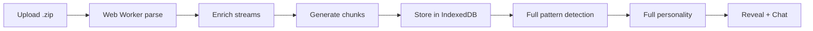

# Technical Architecture

## The Insight: No Server Needed

**Everything runs on the user's device by default.** Zero friction, zero accounts.

| Component | Cost | Who Pays |
|-----------|------|----------|
| LLM inference | $0 | OpenRouter (free tier) |
| Processing | $0 | User's browser |
| Data storage | $0 | User's localStorage/IndexedDB |
| Spotify OAuth | $0 | Spotify (PKCE flow, no backend) |
| Frontend hosting | ~$0 | Vercel free tier |
| **Total per user** | **$0** | |

---

## Architecture: 100% Client-Side

```
User's Browser
├── Two Onboarding Paths:
│   ├── Path A: Quick Snapshot (Spotify OAuth)
│   │   ├── PKCE auth flow (no backend)
│   │   ├── Fetch recent plays & top artists
│   │   └── Lite personality analysis
│   │
│   └── Path B: Full Analysis (File Upload)
│       ├── Upload .zip
│       ├── Parse JSON (Web Worker)
│       └── Full personality classification
│
├── Store in localStorage/IndexedDB
├── Chat via OpenRouter API (with data queries)
└── Generate shareable cards (Canvas API)

Your "backend":
└── Static HTML/JS files only (no serverless needed)
```

---

## Configuration & Persistence

The app uses a layered configuration system:

1.  **Defaults**: `config.js` provides baseline values (placeholders).
2.  **Overrides**: `localStorage` stores user-configured settings (API keys, models).
3.  **UI**: An in-app settings modal allows users to modify these without editing files.
4.  **Priority**: `config.js` > `localStorage` (if `config.js` has non-placeholder values).

---

## File Structure (Current)

```
rhythm-chamber/
├── index.html              # Landing page
├── app.html                # Main analyzer app
├── css/
│   └── styles.css          # All styles including premium/Stripe theme
├── js/
│   ├── config.js           # API keys (gitignored)
│   ├── config.example.js   # Config template (+ Stripe keys)
│   ├── app.js              # Main application controller
│   ├── spotify.js          # Spotify OAuth PKCE + API calls
│   ├── payments.js         # Stripe Checkout + premium status
│   ├── rag.js              # Embeddings + Qdrant vector search
│   ├── parser.js           # .zip file parsing
│   ├── patterns.js         # Pattern detection algorithms
│   ├── personality.js      # Personality classification
│   ├── data-query.js       # Chat data query utilities
│   ├── functions.js        # LLM function schemas + executors
│   ├── chat.js             # OpenRouter chat + function calling + RAG
│   ├── prompts.js          # Editable prompt templates
│   ├── storage.js          # IndexedDB wrapper
│   ├── settings.js         # Settings management & premium UI
│   └── cards.js            # Shareable card generation
├── workers/
│   └── parser-worker.js    # Web Worker for .zip parsing
└── docs/
    └── *.md                # Documentation
```

---

## Data Flow: Two Paths

### Path A: Quick Snapshot (Spotify OAuth)


**Data Available:**
- Last 50 recently played tracks
- Top artists (short/medium/long term)
- Top tracks (short/medium/long term)
- User profile

### Path B: Full Analysis (File Upload)



**Data Available:**
- Complete streaming history
- Skip patterns, play durations
- Era detection, ghosted artists
- Time-of-day patterns

---

## Spotify OAuth: PKCE Flow (No Backend)

```javascript
// js/spotify.js - Client-side PKCE implementation

// 1. Generate code verifier (random string)
const codeVerifier = generateRandomString(64);

// 2. Create code challenge (SHA-256 hash)
const codeChallenge = await generateCodeChallenge(codeVerifier);

// 3. Store verifier and redirect to Spotify
localStorage.setItem('spotify_code_verifier', codeVerifier);
window.location.href = `https://accounts.spotify.com/authorize?
  client_id=${CLIENT_ID}&
  response_type=code&
  redirect_uri=${REDIRECT_URI}&
  code_challenge_method=S256&
  code_challenge=${codeChallenge}&
  scope=user-read-recently-played user-top-read`;

// 4. On callback, exchange code for token
const response = await fetch('https://accounts.spotify.com/api/token', {
  method: 'POST',
  headers: { 'Content-Type': 'application/x-www-form-urlencoded' },
  body: new URLSearchParams({
    grant_type: 'authorization_code',
    code: authorizationCode,
    redirect_uri: REDIRECT_URI,
    client_id: CLIENT_ID,
    code_verifier: storedVerifier
  })
});
```

**Key Benefits:**
- No client secret needed
- No backend required
- Tokens stored in localStorage
- Automatic token refresh support

---

## Chat Architecture: Function Calling

The chat system uses **OpenAI-style function calling** to dynamically query user streaming data.

### Function Calling Flow


### Available Functions (js/functions.js)

| Function | Description | Parameters |
|----------|-------------|------------|
| `get_top_artists` | Top N artists for a period | year, month?, limit? |
| `get_top_tracks` | Top N tracks for a period | year, month?, limit? |
| `get_artist_history` | Full history for an artist | artist_name |
| `get_listening_stats` | Stats for a period | year?, month? |
| `compare_periods` | Compare two years | year1, year2 |
| `search_tracks` | Search for a track | track_name |

### Example Request/Response

```javascript
// User asks: "Show me my top 10 artists from 2020"

// 1. LLM responds with tool_call:
{
  tool_calls: [{
    id: "call_123",
    function: {
      name: "get_top_artists",
      arguments: '{"year": 2020, "limit": 10}'
    }
  }]
}

// 2. Function executes and returns:
{
  period: "2020",
  total_plays: 8234,
  top_artists: [
    { rank: 1, name: "Taylor Swift", plays: 847 },
    { rank: 2, name: "The National", plays: 621 },
    // ... 8 more
  ]
}

// 3. LLM generates final response using real data
```

### Legacy: Context Injection (Fallback)

When function calling is unavailable (no API key, free models that don't support tools), the system falls back to regex-based context injection:

```javascript
// js/chat.js - generateQueryContext()
// Parses user message with regex, queries data, injects into prompt
// Less reliable but works without function calling support
```

---

## Semantic Search (Premium Feature)

### Architecture Overview

Premium users can enable RAG-powered semantic search using their own Qdrant Cloud cluster:


### Components

| Module | Purpose |
|--------|---------|
| `payments.js` | Stripe Checkout, premium status in localStorage |
| `rag.js` | Embeddings API, Qdrant client, chunking logic |

### Embedding Generation

```javascript
// js/rag.js - generateEmbeddings()
// 1. Load all streams from IndexedDB
// 2. Create chunks (monthly summaries + artist profiles)
// 3. Generate embeddings via OpenRouter (qwen/qwen3-embedding-8b)
// 4. Upsert to user's Qdrant cluster
// 5. Store config + status in localStorage
```

### Chunk Types

| Type | Content |
|------|---------|
| `monthly_summary` | Month listening stats, top 10 artists/tracks |
| `artist_profile` | Artist history, play count, first/last listen, top tracks |

### Chat Integration

```javascript
// In chat.js sendMessage()
if (window.RAG?.isConfigured()) {
    semanticContext = await window.RAG.getSemanticContext(message, 3);
    // Injects top 3 matching chunks into system prompt
}
```

### User Setup Flow

1. Complete Stripe Checkout → Premium activated
2. Create free Qdrant Cloud cluster
3. Enter Qdrant URL + API key in Settings
4. Click "Generate Embeddings" → Progress bar
5. Semantic search now active in chat

## Storage: IndexedDB + localStorage

```javascript
// js/storage.js

// Streams stored in IndexedDB (large data)
await db.put('streams', { id: 'user-streams', data: parsedStreams });
await db.put('chunks', { id: 'user-chunks', data: chunks });

// Personality stored in IndexedDB
await db.put('personality', { id: 'user', ...personality });

// Spotify tokens in localStorage
localStorage.setItem('spotify_access_token', token);
localStorage.setItem('spotify_token_expiry', expiry);
```

---

## Pattern Detection

### Full Analysis Patterns (patterns.js)

| Pattern | Description |
|---------|-------------|
| `eras` | Distinct listening periods based on taste shifts |
| `ghostedArtists` | Artists you stopped listening to |
| `trueFavorites` | Artists with high completion rates |
| `timeOfDay` | Morning vs evening listening patterns |
| `weekdayWeekend` | Weekday vs weekend differences |
| `skipBehavior` | Skip patterns and completion rates |

### Lite Analysis Patterns (Spotify API data)

| Pattern | Description |
|---------|-------------|
| `diversity` | Artist variety in recent plays |
| `currentObsession` | Most repeated artist recently |
| `tasteStability` | Short-term vs long-term taste consistency |
| `risingStars` | New artists entering rotation |
| `genreProfile` | Top genres from artist data |

---

## Personality Types

### Full Personality Types

| Type | Description |
|------|-------------|
| Emotional Archaeologist | Uses music to process feelings |
| Mood Engineer | Strategically deploys music |
| Discovery Junkie | Always seeking new artists |
| Comfort Curator | Sticks to beloved favorites |
| Social Chameleon | Music adapts to context |

### Lite Personality Types

| Type | Description |
|------|-------------|
| The Current Obsessor | Deep in one sound right now |
| The Sound Explorer | Always seeking new territory |
| The Taste Keeper | Knows exactly what they love |
| The Taste Shifter | Musical journey in motion |

---

## Chat: OpenRouter Integration

```javascript
// js/chat.js

async function sendMessage(message) {
  // Generate query context from user's question
  const queryContext = generateQueryContext(message);
  
  // Build dynamic system prompt
  const systemPrompt = buildSystemPrompt(queryContext);
  
  const response = await fetch('https://openrouter.ai/api/v1/chat/completions', {
    method: 'POST',
    headers: {
      'Authorization': `Bearer ${OPENROUTER_KEY}`,
      'Content-Type': 'application/json',
      'HTTP-Referer': window.location.origin,
      'X-Title': 'Rhythm Chamber'
    },
    body: JSON.stringify({
      model: 'mistralai/mistral-7b-instruct:free',
      messages: [
        { role: 'system', content: systemPrompt },
        ...conversationHistory
      ],
      max_tokens: 500,
      temperature: 0.7
    })
  });
  
  return response.json();
}
```

---

## Cost Analysis

### Default (Free Tier)

| Resource | Cost |
|----------|------|
| Vercel hosting | $0 |
| OpenRouter free models | $0 |
| localStorage/IndexedDB | $0 |
| Spotify OAuth (PKCE) | $0 |
| **Total** | **$0** |

### With Premium LLM

| Resource | Cost |
|----------|------|
| Premium LLM models | ~$0.003/1K tokens |
| **Total** | **~$1-5/month** |

---

## Security Considerations

| Concern | Mitigation |
|---------|------------|
| API keys exposed | Use BYOK (bring your own key) model |
| Spotify tokens | Stored in localStorage, cleared on reset |
| User data | Never leaves browser, no server storage |
| PKCE flow | Prevents code interception attacks |

---

## Deployment

### Static Site Deployment (Vercel/Netlify)

1. Clone repository
2. Copy `js/config.example.js` to `js/config.js`
3. Add Spotify Client ID from Developer Dashboard
4. Add redirect URI to Spotify app settings
5. Deploy static files

### Local Development

```bash
# Simple HTTP server
python -m http.server 8080

# Or use any static file server
npx serve .
```

---

## Future Enhancements (Post-MVP)

- [ ] Cloud sync option (Qdrant/Pinecone)
- [ ] WASM embeddings for semantic search
- [ ] Playlist generation based on patterns
- [ ] Social comparisons (opt-in)
- [ ] Mobile app wrapper
